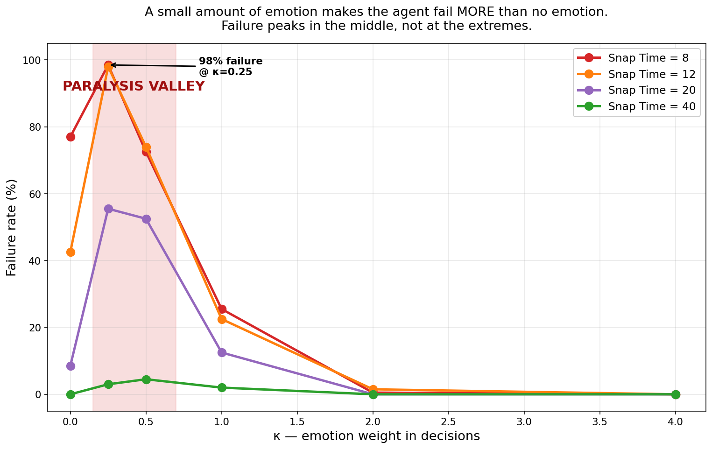
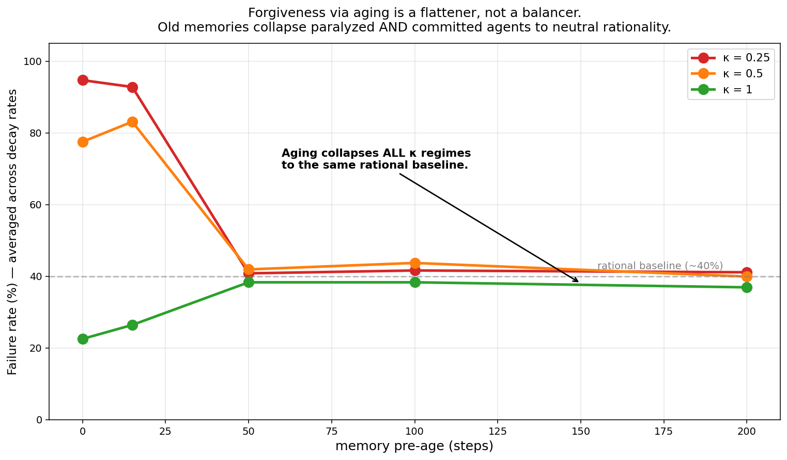
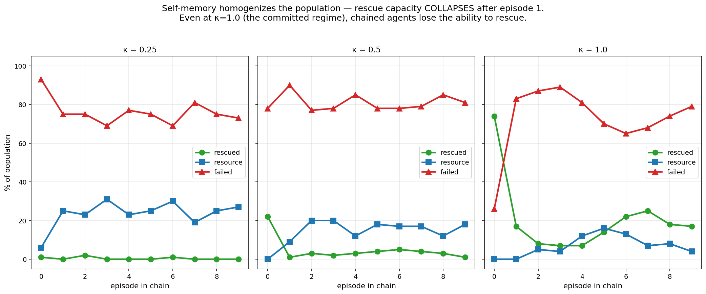

# snap-time-agent

A research codebase for **human-like AI agents** — agents that behave like
people behave, not like solvers solve.

Modern AI optimizes correctness:

```
θ* = argmin_θ [ E(-log p_θ(y|x)) - β·E(r(x,y)) + γ·KL(π_θ ‖ π_ref) ]
```

This repo extends that objective with internal state — emotion, memory, and
bounded autonomy time — so agents can hesitate, forget, forgive, and make
calculated mistakes:

```
θ* = argmin_θ E_τ [
        Σ_{t=0}^{T_snap} (
            L(f_θ(x_t), y_t)
          + Φ( v(s_t, a_t), e_t )
          + λ · MemoryImpact_t
        )
      ]
```

Where:

- **e_t = [survival, guilt, loyalty, fear, curiosity] ∈ [0,1]^5** —
  emotion as a vector, not a scalar.
- **MemoryImpact = exp(−β·age) · exp(α·importance) · exp(γ·|emotion|) ·
  sim(context, memory)** — memory fades with age, persists with importance and
  emotion, and reactivates by similarity.
- **t ∈ [0, T_snap]** — *Snap Time*: a bounded autonomy window during which
  the agent thinks, hesitates, and commits.
- **Φ(v, e_t)** — emotion-weighted decision pressure where guilt or loyalty
  can override survival.

## What's in this repo

```
src/                  core framework — emotion, memory, decision, sandbox
src/exp_*.py          one experiment runner per sweep
src/make_*_visuals.py one chart-builder per wave
experiments/          experiments by name; each folder has config + results + charts
docs/findings_*.md    written-up findings per wave
docs/posts/           LinkedIn-ready writeups
tests/                sanity checks on the dynamics
```

## Findings to date (80,800 episodes across 8 sweeps)

### Wave 1 — `regime_map_v1`
**The Paralysis Valley**: failure rate is non-monotonic in emotion weight κ.
A small amount of emotion makes the agent fail MORE than no emotion AND more
than strong emotion. Three regimes emerge: rational (κ≈0), paralyzed
(κ≈0.25–0.5), committed (κ≥1).



### Wave 2 — `severity_sweep_v1`, `phi_mode_v1`, `forgiveness_v1`
- **Severity threshold**: the valley does not exist below memory-severity ≈ 0.4.
- **Multiplicative Φ**: removes the valley entirely but eliminates rescue
  capacity — value-greedy at all κ.
- **Forgiveness Tradeoff**: aging the memory escapes the valley by
  collapsing all κ regimes to neutral rationality. There is no preage where
  the agent both escapes paralysis AND keeps the capacity to commit.



### Wave 3 — `couplings_v1`, `resonance_v1`, `hysteresis_v1`, `phase_boundary_v1`
- **No-free-lunch across 4 Φ couplings**: additive, multiplicative, max,
  log-sum-exp — each has a distinct pathology, none give both no-paralysis
  AND robust rescue.
- **Stochastic resonance is local**: emotion noise rescues at the valley
  shoulder (κ=0.5) but not at the bottom (κ=0.25).
- **Homogenization Collapse** (the headline): in chained episodes with
  carried memory + outcome encoding, the committed-rescuer regime collapses
  in ONE episode. All initial conditions converge to the same failure
  attractor — no individual differentiation emerges from experience.
- **Phase boundary**: the valley narrows and shifts right with longer Snap
  Time but never vanishes (residual 63% peak even at T_snap=20).



## Reproducing the experiments

```
pip install -r requirements.txt

# Wave 1 — original regime map
python -m src.run_sweep
python -m src.analyze
python -m src.make_post_visuals

# Wave 2 — severity, phi-mode, forgiveness
python -m src.exp_severity
python -m src.exp_phi_mode
python -m src.exp_forgiveness
python -m src.make_v2_visuals

# Wave 3 — couplings, resonance, hysteresis, phase boundary
python -m src.exp_couplings
python -m src.exp_resonance
python -m src.exp_hysteresis
python -m src.exp_phase_boundary
python -m src.make_v3_visuals
```

Each experiment writes its CSV + charts to `experiments/<name>_v1/`.

## Findings docs

- `docs/findings_v2.md` — Wave 2 writeup
- `docs/findings_v3.md` — Wave 3 writeup
- `docs/posts/` — drafts in social-post form, including LinkedIn-ready

## Status

Active research. Findings get posted as I run them.

## License

MIT — see LICENSE.
