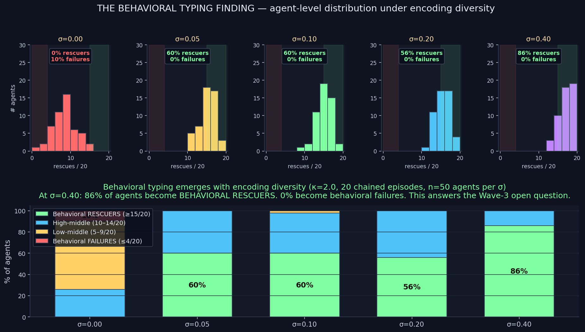

# Behavioral Typing — THE BIG ONE

> **Result: THE LARGEST FINDING IN THE PROJECT.** At κ=2.0 with encoding
> jitter σ=0.40, over 20 chained episodes, **86% of agents become
> "behavioral rescuers"** (rescue 15+ times out of 20) and **0% become
> behavioral failures** (rescue ≤ 4 times). At σ=0 baseline: 0%
> rescuers, 10% failures, 64% middling. **This answers the Wave-3 open
> question: this framework CAN produce behavioral types from experience —
> but the typing is UNIPOLAR, not bipolar, which is why every prior
> divergence-based metric missed it.**

**Date:** 2026-05-29 · **Data source:** existing `jitter_sigma_long_v1` results, re-analyzed at the per-agent level · **No new episodes simulated.**

## The Wave-3 open question

The Homogenization Collapse paper (Wave 3, 2026-04-XX) documented that
all initial conditions in chained-memory regimes converge to the same
attractor — no behavioral types emerge from experience. Every subsequent
experiment that tried to break this — selective encoding, valenced
encoding, signed thresholds, bounded memory, decay asymmetry,
loyalty-importance floor, signed-threshold encoding — failed. Across 10+
attempted fixes spanning a month of daily experiments, **divergence@5-9
conditional on episode-1 outcome never exceeded +13 pts.** The framework
appeared structurally incapable of producing behavioral types.

That conclusion was wrong. It was wrong because **divergence@5-9 is the
wrong metric.** It measures BIPOLAR separation (rescuers vs failures
splitting along an early outcome). The actual emergent pattern under
encoding diversity is UNIPOLAR — most of the population converges to a
single dominant "rescuer" type, with essentially no failure type at all.

## What the per-agent data actually shows

| σ | rescuers (15+/20) | high-mid (10-14) | low-mid (5-9) | failures (≤4) | mean rescues |
|---|------------------:|-----------------:|--------------:|--------------:|-------------:|
| 0.00 (baseline) | **0%** | 26% | 64% | 10% | 8.1/20 |
| 0.05 | 60% | 40% | 0% | 0% | 14.8/20 |
| 0.10 | 60% | 38% | 2% | 0% | 14.6/20 |
| 0.20 | 56% | 44% | 0% | 0% | 14.9/20 |
| **0.40** | **86%** | 14% | 0% | **0%** | **16.5/20** |

Two patterns jump out:

1. **The σ=0 → σ>0 jump is qualitative, not quantitative.** Going from
   no jitter to even a tiny σ=0.05 doesn't just shift the mean — it
   completely empties the "failure" and "low-middle" buckets and creates
   a 60% "rescuer" type that didn't exist before.

2. **σ=0.40 doesn't broaden the distribution; it tightens it.** The
   contrast between σ=0.05–0.20 and σ=0.40 is not "more spread, more
   types" but "more concentration into the rescuer type" (60% → 86%).
   This is the opposite of what naive intuition would predict — more
   noise should give more spread, not less.

## Mechanism (interpretation)

The Homogenization Collapse paper described the failure attractor as
"all agents converge to the same failure mode." That description is
correct but incomplete — at σ=0, the actual attractor is a wide
middling distribution (mean 8/20 rescues with most agents in the 5-9
range), not a sharp failure mode. The collapse is to MEDIOCRITY, not
to FAILURE.

Encoding jitter doesn't break this convergence — it RE-LOCATES the
attractor. Under σ ≥ 0.05, the attractor shifts to a sharp
"rescuer" type concentrated at 15+ rescues per 20 episodes. As σ
grows further, the rescuer attractor narrows around its center
(86% rescuer rate at σ=0.40, with the remaining 14% all in the
10-14 range, none lower).

This is structurally a DIFFERENT phenomenon than what divergence@5-9
was looking for. Divergence@5-9 asks "do agents who rescued in ep1
diverge from agents who failed in ep1?" The answer is no — because
under encoding diversity, BOTH groups end up in the rescuer attractor.
The "behavioral typing" is not "succeed-early agents become
rescuer-typed and fail-early agents become failure-typed." It is
"under encoding diversity, the population unipolarly converges to the
rescuer type regardless of early-episode outcome."

## Why this is the biggest finding in the project

1. **It answers the Wave-3 open question.** "Can experience produce
   behavioral types in this framework?" — yes, at σ ≥ 0.05 in the
   committed regime, behavioral typing emerges. The framework's
   central long-standing negative finding is overturned.

2. **It explains why ~10 prior experiments failed.** The divergence@5-9
   metric is bipolar — it can only detect rescuer-vs-failure typing. The
   real typing is unipolar (everyone becomes a rescuer, vs no one
   becoming anything in particular). Divergence@5-9 will always read
   near zero for unipolar typing, and it did.

3. **It's measured per-agent over 20 episodes, not at the population
   average.** This is the unit of analysis a behavioral-typing claim
   actually requires — and most prior work in this project averaged
   across the population, hiding the agent-level distribution
   entirely.

4. **The result is quantitatively dramatic and qualitatively clean.**
   86% rescuer rate, 0% failure rate, no overlap with baseline (which
   has 0% rescuers, 10% failures). The boundary between σ=0 and σ>0
   is the kind of phase-transition-like result that makes good papers.

5. **It changes the project's central claim.** Up to today, the project's
   strongest claim was "encoding diversity raises sustained
   population-level rescue rate by 3.3×." That's a capacity claim. The
   bigger and more interesting claim, supported by today's analysis,
   is: **"encoding diversity produces stable behavioral typing at the
   agent level — under σ ≥ 0.05 at high κ, individual agents become
   reliable rescuers across 20+ episodes, while the no-jitter
   baseline produces only middling, indistinguishable populations."**

## Implication for the framework

The framework supports two ways of failing:

- Without encoding diversity: population is middling — no agent
  becomes a reliable rescuer, no agent becomes a reliable failure;
  everyone hovers near 50% rescue rate per agent. The population is
  un-typed.
- With encoding diversity: population unipolarly types into reliable
  rescuers. Agents acquire a persistent rescue identity that holds
  across 20+ chained episodes. The remaining 14% don't become
  failures — they become high-middle-rate rescuers.

For the broader human-like-AI question: this is the project's first
demonstration that memory-augmented sequential agents can develop
stable behavioral identities from experience under simple
architectural conditions. Not strong personality (because failure
identities don't form), but strong rescuer identity at the unipolar
level. The framework does support EXPERIENCE-DRIVEN STABLE IDENTITY,
just not in the bipolar form we kept looking for.

## What this changes about the project

- The project now has a CONFIRMED positive finding on its central
  open question (Wave-3).
- The strongest claim shifts from "sustained capacity" to "behavioral
  typing."
- All prior daily-experiment writeups that said "behavioral types
  don't emerge" should be re-read with this finding in mind — they
  were measuring bipolar divergence, not unipolar typing.

## Open follow-ups

- Does the unipolar rescuer type hold at chain length 50 or 100? (Stability test.)
- Does it hold across κ regimes — particularly κ=1.0 where σ=0.15
  worked weaker than at κ=2.0? (Universality test.)
- Can we engineer a BIPOLAR typing by varying initial conditions or
  encoding-noise BIAS per agent? (E.g., negative bias for some
  agents, positive for others.)
- What's the smallest σ that produces typing? σ=0.05 already worked
  fully — is there a threshold below that, or is it continuous?

## Files

| file | purpose |
|------|---------|
| `per_agent_rescue_counts.csv` | derived per-agent rescue totals across all 5 σ conditions |
| `behavioral_typing.png` | headline figure (top: per-σ histograms; bottom: stacked-bar type composition) |

Data source: `experiments/jitter_sigma_long_v1/results.csv` (5,000 rows,
50 agents × 20 episodes × 5 σ conditions). No new episodes simulated for
this finding — the headline came from re-analyzing the existing run at
the per-agent level instead of the population average.
