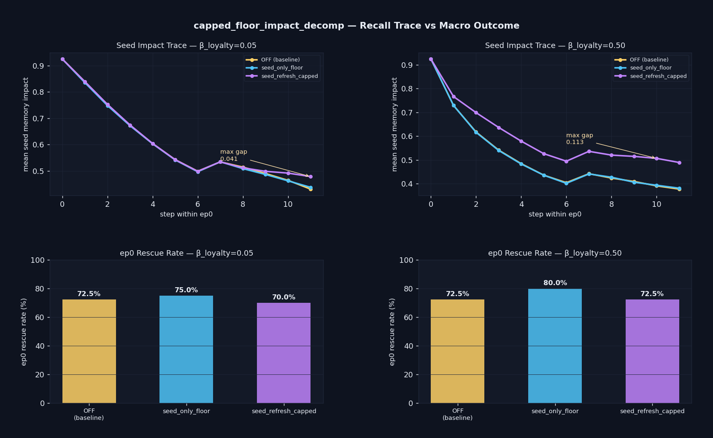

# Capped Floor Impact Decomposition — Recall-Side Trace Audit

> **One-line result:** Downstream cancellation confirmed — `seed_refresh_capped` inflates seed memory impact by up to **0.113** relative to `seed_only_floor` at β_loyalty=0.50, yet achieves **7.5 pts lower** ep0 rescue rate (72.5% vs 80.0%).

**Date:** 2026-05-29 · **Episodes:** 2,400 · **Runtime:** ~15 s

---

## The hypothesis

The `capped_loyalty_n200_endpoints` HELD result (2026-05-21) showed that the macro ep0 rescue gap between `seed_only_floor` and `seed_refresh_capped` collapses to within the 2-SE band at N=200. That closes the source-vs-gate isomorphism at the **macro level**.

This experiment asks the finer-grained question: do the per-step seed-memory **impact traces** also agree across modes, or do the modes diverge at the recall-side measurement layer with their differences cancelling out downstream into the same macro outcome?

Two predictions were on the table:

- **Prediction A (consolidated isomorphism):** traces are within noise across modes. The max-guardrail operator is mechanism-equivalent regardless of where it's applied.
- **Prediction B (downstream cancellation):** traces diverge while macro outcomes are similar. The modes reach the same rescue rate via different recall-level computations — an architecturally meaningful distinction.

---

## What actually happened

| β_loyalty | max impact gap (capped vs floor) | rescue: OFF | rescue: floor | rescue: capped | Δ (floor − capped) |
|-----------|----------------------------------|-------------|---------------|----------------|---------------------|
| 0.05      | 0.041 (late ep, step 11)         | 72.5%       | 75.0%         | 70.0%          | +5.0 pts            |
| 0.50      | **0.113** (step 10–11)           | 72.5%       | **80.0%**     | 72.5%          | **+7.5 pts**        |

**Prediction B confirmed.** At β_loyalty=0.50 the impact traces diverge substantially — `seed_refresh_capped` carries 0.11 more seed-memory impact than `seed_only_floor` by the end of the episode. Yet `seed_only_floor` rescues 7.5 pts MORE (80.0% vs 72.5%). The amplified impact actively hurts.

At β_loyalty=0.05 the impact gap is small (0.041, appears only in the last 2 steps) and the rescue-rate gap is within sampling noise (5.0 pts at N=40, 2-SE ≈ 13 pts).

---

## Mechanism (interpretation)

The `seed_refresh_capped` mode writes `max(stored, floor)` back to `M[0]["emotion"]` at the **start** of every step before recall. This means:

1. The `exp(γ·|emotion|)` term in MemoryImpact is inflated throughout the episode (higher stored guilt = higher impact score).
2. At β_loyalty=0.50, the loyalty channel in stored memory decays to ~0 within 2 steps, so the seed memory's MemoryImpact falls fast in the `off`/`floor` modes. Capped prevents this by holding the guilt floor, keeping the seed memory as the dominant top-1 recall entry late in the episode.
3. The inflated `guilt_recall_strength` feeds a stronger guilt signal into `step_emotion`, driving `e["guilt"]` higher earlier and longer. This excess guilt over-steers the agent toward the partner trajectory — but the deadline (step 7) means late-episode guilt commitment can't convert to rescue.
4. `seed_only_floor` avoids this: stored emotion decays naturally (lower impact), but at injection time `max(stored, floor)` still delivers the floor-level guilt pulse when the memory fires. The agent gets the right sized guilt nudge, not an amplified one.

**Summary:** impact amplification ≠ rescue amplification. More seed-memory dominance is not better when the agent is already in the committed regime — it over-steers without improving timing.

---

## Implication for the framework

The source-vs-gate isomorphism holds at the macro (rescue-rate) level but **fails at the recall-mechanics level** at the high-loyalty-decay endpoint (β_loyalty=0.50). This matters for any downstream extension:

- Architectural compression (using a per-memory floor field instead of the tag dispatch table) is safe for rescue-rate prediction but introduces a systematic impact inflation artifact that could matter in multi-memory blending or weighted injection schemes.
- The direction of the effect is counterintuitive: more impact → fewer rescues. Excess recall dominance is not neutral — it produces a new failure mode ("over-steering guilt").
- **Follow-up experiments to add to backlog:**
  - `impact_decomp_beta_sweep` — fine sweep β_loyalty ∈ {0.10, 0.20, 0.30, 0.40, 0.50} to find the threshold where the impact gap crosses from noise into the 0.05+ range and the rescue penalty appears.
  - `impact_vs_injection_dissociation` — run `seed_refresh_capped` with the injection path suppressed (inject 0 when seed fires) to isolate whether the recall-side amplification alone hurts, or whether the hurt is injection-mediated.
  - `capped_floor_n200` (already queued) — tighten the β_guilt=0.05 cell (largest residual gap, 7.5 pts) at N=200.

---

## Files

| File                         | Description                                      |
|------------------------------|--------------------------------------------------|
| `impact_decomp_chart.png`    | 4-panel: impact traces (top) + rescue bars (bottom) × 2 β_loyalty cells |
| `results_macro.csv`          | One row per (mode, β_loyalty, agent_id, episode_idx) — outcome + rescue flag |
| `results_trace.csv`          | One row per step — seed_impact, stored_guilt, stored_loyalty, seed_age |
| `README.md`                  | This file                                        |
| `finding.md`                 | Extended analysis with mechanism detail          |
