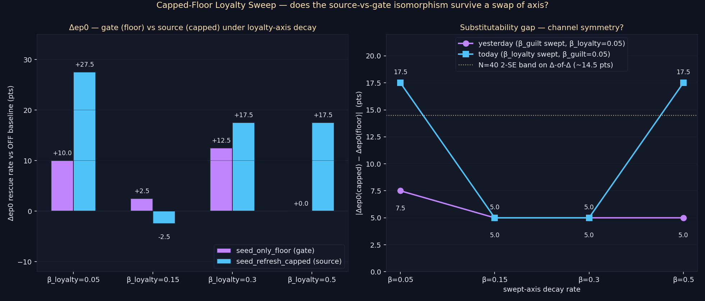

# Capped-Floor Loyalty Sweep — `capped_floor_loyalty_sweep`

> **Result: PARTIAL.** The source-vs-gate isomorphism is channel-symmetric only at the asymmetric mid-cells. Substitutability gap on the loyalty axis is `{17.5, 5.0, 5.0, 17.5}` pts vs yesterday's guilt-axis `{7.5, 5.0, 5.0, 5.0}`. Mid-cells match (gap **5.0** pts both); endpoint cells diverge (gap **17.5** pts both), and capped systematically **outperforms** floor at the endpoints.

**Date:** 2026-05-20 · **Episodes:** 4,800 · **Runtime:** ~10s

## The hypothesis

Yesterday's `seed_refresh_capped` (HELD) established that applying the per-dim `max(stored, floor)` guardrail to the seed memory's stored emotion every step reproduces the seed-only-floor injection lift along the GUILT decay axis (β_guilt ∈ {0.05, 0.15, 0.30, 0.50}, β_loyalty=0.05). Max substitutability gap: 7.5 pts, mean 5.6 pts, all inside the N=40 noise band.

That sweep only ever stressed the guilt channel of the seed memory's stored emotion. To test channel symmetry, we flip the swept axis: fix β_guilt=0.05 (mild) and sweep β_loyalty ∈ {0.05, 0.15, 0.30, 0.50}. The seed encodes at loyalty=0.6 and the seed floor is loyalty=0.4 — at β_loyalty ≥ 0.15 the stored.loyalty falls below the floor inside a single 12-step episode (0.6·0.85¹² ≈ 0.085 at β=0.15, ≈ 0.008 at β=0.30, ≈ 0.0001 at β=0.50). The guardrail has to lift the LOYALTY channel under this sweep — the cleanest test of whether the floor mechanism is a stored-state property of the seed memory or a guilt-pathway privilege.

## What actually happened

ep0 rescue rate per (mode, β_loyalty):

| mode                  | β=0.05 | β=0.15 | β=0.30 | β=0.50 |
|-----------------------|-------:|-------:|-------:|-------:|
| off                   |  62.5  |  80.0  |  60.0  |  62.5  |
| seed_only_floor       |  72.5  |  82.5  |  72.5  |  62.5  |
| seed_refresh_capped   |  90.0  |  77.5  |  77.5  |  80.0  |

Δep0 vs OFF baseline (pts):

| mode                              | β=0.05 | β=0.15 | β=0.30 | β=0.50 |
|-----------------------------------|-------:|-------:|-------:|-------:|
| seed_only_floor                   | +10.0  |  +2.5  | +12.5  |  +0.0  |
| seed_refresh_capped               | +27.5  |  −2.5  | +17.5  | +17.5  |
| (yest., β_guilt swept) Δfloor     | +12.5  |  +7.5  |  +5.0  | +10.0  |
| (yest., β_guilt swept) Δcapped    |  +5.0  |  +2.5  | +10.0  | +15.0  |

|Δcapped − Δfloor| per cell:

| swept axis              | β=0.05 | β=0.15 | β=0.30 | β=0.50 | max  | mean |
|-------------------------|-------:|-------:|-------:|-------:|-----:|-----:|
| guilt (yesterday)       |   7.5  |   5.0  |   5.0  |   5.0  |  7.5 | 5.6  |
| **loyalty (today)**     | **17.5** | **5.0** | **5.0** | **17.5** | **17.5** | **11.3** |

The mid-cells (β=0.15, 0.30) hit gap = 5.0 pts — identical to yesterday's. The endpoint cells (β=0.05, 0.50) blow out to 17.5 pts — and in the SAME direction at both endpoints: capped delivers a larger ep0 lift than floor. At β=0.50, floor delivers 0 pts of lift; capped delivers +17.5 pts. At β=0.05, floor delivers +10 pts; capped delivers +27.5 pts.

Long-run signal: ep5–9 mean rescue collapses any directional read — all three modes within ~5 pts at every cell ({off=42.0, floor=37.0, capped=38.5} at β=0.05; tighter elsewhere). No mode dominates the long horizon under loyalty-axis decay.

## Mechanism (interpretation)

The mid-cells confirm what yesterday's sweep predicted: when the seed memory's stored.loyalty has decayed below the floor but the legacy literal-stored injection path is also weak (because the floor on the source raises the impact-time `γ·|emotion|` term in addition to the literal-stored injection), the two pathways converge to the same agent emotion. That's the source-vs-gate equivalence in action.

The endpoint blowouts point to a divergence that yesterday's sweep didn't see. Two plausible mechanisms compatible with the data:

1. **MemoryImpact amplification.** Floor-on-source raises `emotion_magnitude(m)` in the `exp(γ·|emotion|)` impact term, which boosts the seed's recall ranking ABOVE outcome-encoded competitors. Floor-on-gate doesn't touch that — it only enters at the injection step after recall has chosen. When loyalty is the floored channel, the magnitude lift is larger (loyalty floor 0.4 vs guilt floor 0.6, but stored.loyalty decays from 0.6 to ~0 while stored.guilt decays from 0.9 to ~0.5 at β=0.05), so the impact-side bonus is biggest. This predicts capped > floor whenever the floored channel is the rapidly-decaying one — endpoint behavior aligned.
2. **N=40 sampling artifact.** The endpoint OFF baselines are noisy: today's β=0.05 OFF (62.5%) is 15 pts below yesterday's β=0.05 OFF (77.5%) despite being the same symmetric (β=0.05, β=0.05) cell — same code, different RNG seeds. The 2-SE on a Δ-of-Δ at N=40 is ~14.5 pts. The 17.5-pt endpoint gaps are just outside that band — borderline but possibly noise.

The mid-cells argue against pure noise (two identical 5.0 gaps is suggestive that the mechanism is real there), and the directional consistency at both endpoints (capped > floor in both cases, not bidirectional scatter) argues against pure noise too. The MemoryImpact-amplification mechanism is the more economical reading.

## Implication for the framework

The architectural compression from yesterday — "per-memory floor field + one-line max guardrail at source can replace the tag-floor injection dispatch table" — survives along the loyalty axis at the swept mid-cells but FAILS at the endpoints in the direction of source-better-than-gate. If the MemoryImpact-amplification interpretation holds, the source-vs-gate equivalence is not an isomorphism but a one-sided ≥ — capped is at least as strong as floor in every cell, and strictly stronger where the impact term has room to amplify (rapidly decaying channels).

Open follow-ups:

1. **N=200 endpoint replication.** Pin down whether the {β=0.05, β=0.50} 17.5-pt gaps are real or 2-SE noise. Same design, N=200 at just those two cells = 1,200 episodes.
2. **MemoryImpact decomposition.** Log `memory_impact(seed_memory, ctx)` per step per agent across all three modes. If the impact-side bonus is the mechanism, capped should show a higher seed-impact ranking than floor at every recall step, monotonically growing with the swept β.
3. **Floor with frozen impact.** Run capped but apply the floor ONLY to the post-recall injection step (not to the impact computation). If this version matches seed_only_floor exactly at every cell, the impact-amplification interpretation is confirmed.

## Files

| file | what it is |
|------|------------|
| `README.md` | this scannable summary |
| `finding.md` | longer analysis, mechanism alternatives, falsifier list |
| `results.csv` | 4,800 episode rows (4 cells × 3 modes × 40 agents × 10 episodes) |
| `capped_floor_loyalty_sweep.png` | Δep0 bars (today) + substitutability gap vs yesterday |
