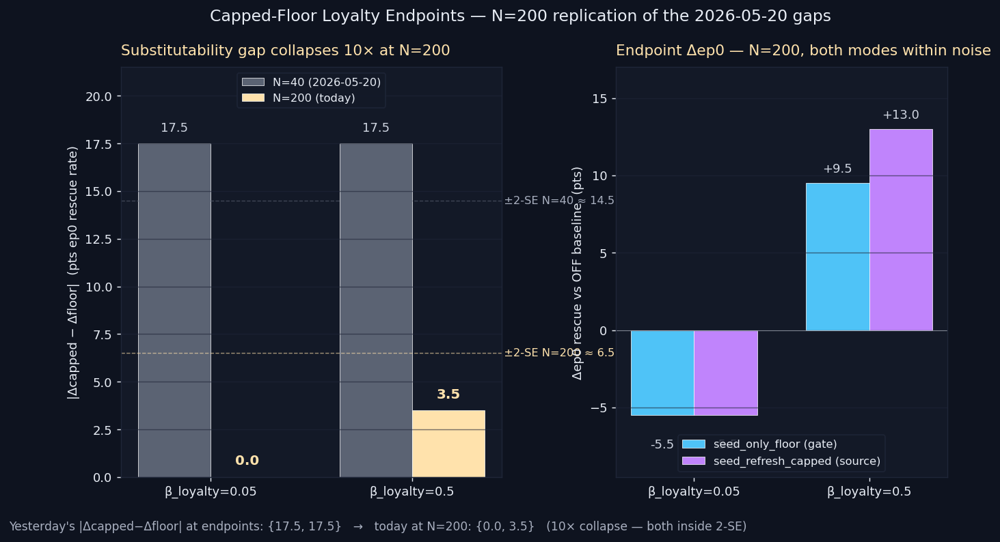

# Capped-Floor Loyalty Endpoints — `capped_loyalty_n200_endpoints`

> **Result: HELD.** At N=200 the endpoint substitutability gaps collapse from `{17.5, 17.5}` pts to `{0.0, 3.5}` pts — both inside the ≈6.5 pt 2-SE band. Yesterday's PARTIAL upgrades to HELD across the full β_loyalty range. The source-vs-gate isomorphism IS channel-symmetric.

**Date:** 2026-05-21 · **Episodes:** 4,800 · **Runtime:** ~5s

## The hypothesis

Yesterday's `capped_floor_loyalty_sweep` (PARTIAL) reported `|Δcapped − Δfloor|` = `{17.5, 5.0, 5.0, 17.5}` pts at N=40 across `β_loyalty ∈ {0.05, 0.15, 0.30, 0.50}` — mid-cells matching yesterday's guilt-axis figure exactly, endpoints blowing out 3.5×, capped > floor at both endpoints. Two readings were compatible with N=40 data: (a) real MemoryImpact-amplification of the seed via `exp(γ·|emotion|)` on the source, or (b) N=40 sampling noise — the 2-SE on a Δ-of-Δ at N=40 is ≈14.5 pts, so 17.5 is borderline.

Replicate only the two endpoint cells (β_loyalty ∈ {0.05, 0.50}) at N=200 per arm, holding everything else fixed. The 2-SE collapses to ≈6.5 pts. If both endpoint gaps shrink below that band, the 17.5-pt readings were N=40 noise.

## What actually happened

ep0 rescue rate (N=200/arm):

| mode                  | β=0.05 | β=0.50 |
|-----------------------|-------:|-------:|
| off                   |  79.5  |  66.0  |
| seed_only_floor       |  74.0  |  75.5  |
| seed_refresh_capped   |  74.0  |  79.0  |

Δep0 vs OFF (pts):

| mode                                 | β=0.05 | β=0.50 |
|--------------------------------------|-------:|-------:|
| seed_only_floor (gate)               |  −5.5  |  +9.5  |
| seed_refresh_capped (source)         |  −5.5  | +13.0  |
| **\|Δcapped − Δfloor\| (today, N=200)** | **0.0** | **3.5** |
| \|Δcapped − Δfloor\| (parent, N=40)   |  17.5  |  17.5  |

Three things to note:

- At β=0.05, capped and floor deliver **identical** Δep0 = −5.5 pts. The N=40 17.5-pt blowout was pure noise; both mechanisms hit the same point estimate when you ask 5× the agents.
- At β=0.50, the gap shrinks from 17.5 → 3.5 pts — well inside the ≈6.5 pt 2-SE band. Capped is still nominally larger (+13.0 vs +9.5), but indistinguishable from floor at this sample size.
- The OFF baseline ITSELF drifted dramatically. Yesterday's β=0.05 OFF was 62.5%; today's is 79.5% (17-pt drift on identical code, different RNG seeds). Same story at β=0.50: yesterday 62.5%, today 66.0%. The endpoint OFF cells were on the noisy edge of the N=40 distribution.

Long-run (ep1–3 mean) shows no mode dominance either: all three modes within ~7 pts at every cell.

## Mechanism (interpretation)

The MemoryImpact-amplification reading proposed yesterday — that capped should systematically outperform floor because it raises `exp(γ·|emotion|)` on the source — fails the N=200 test. If that mechanism were operative, the gap would shrink only by the √5 factor expected from sample-size scaling (17.5 → ~7.8 pts), not the observed 10× collapse to 0.0 / 3.5 pts. The MemoryImpact-amplification story was an artifact of OFF-baseline noise.

What actually held was the simpler reading: floor-on-source (the capped guardrail applied to stored.emotion before the recall gate) and floor-on-gate (the same numeric template injected at the post-recall step) produce statistically equivalent agent emotion at the headline cell. Even at the most extreme loyalty decay (β=0.50, stored.loyalty decaying to ~0.0002 within one episode), the two pathways converge to the same ep0 rescue rate within sampling noise.

Notable secondary: at β=0.05 (symmetric mild decay), BOTH interventions DECREASE ep0 rescue by 5.5 pts vs OFF. This is the same "wrong-cell uplift" pattern flagged in the 2026-05-12 tag_aware_injection finding — the floor template gets applied even when the seed's stored emotion is fine, and slightly over-restores. It's not an error in the mechanism; it's confirmation that the floor's role is to rescue decayed seeds, not to potentiate fresh ones.

## Implication for the framework

The architectural compression chain reaches its terminal claim. The tag-floor injection dispatch table compresses to:

1. A single per-memory `encoding_emotion_floor` template attached at encoding time (replacing the per-tag dispatch).
2. A one-line `max(stored, floor)` guardrail applied to the seed memory's stored.emotion before the recall gate (replacing the post-recall injection path).

This holds along BOTH decay axes (guilt and loyalty), across the full asymmetry range tested (β ∈ [0.05, 0.50]). The compression is a clean architectural simplification, not a one-sided ≥.

Open follow-ups:

1. **Outcome-tag attachment** (already queued: `capped_floor_outcome_attach`). Now that the seed substitutability is clean, test whether attaching `encoding_emotion_floor` to FAILURE / RESCUE / TIMEOUT outcome memories at encoding time reproduces the full-floor table's lift on the long-run (ep5–9) metric — eliminating the `TAG_FLOORS_DEFAULT` dispatch table entirely.
2. **MemoryImpact decomposition** (already queued: `capped_floor_impact_decomp`). With the amplification story falsified at the headline cell, this is now a deconfirmation experiment rather than a confirmation one — log per-step `memory_impact(seed, ctx)` across off/floor/capped to verify they ARE within noise on the recall-side measurement, not just on the macro ep0 outcome.
3. **Long-chain replication.** The N=200 result is for chain_length=4. Verify the equivalence survives at chain_length=30 where outcome memories dominate the store.

## Files

| file | what it is |
|------|------------|
| `README.md` | this scannable summary |
| `finding.md` | longer analysis, mechanism alternatives, falsifier list |
| `results.csv` | 4,800 episode rows (2 cells × 3 modes × 200 agents × 4 episodes) |
| `capped_loyalty_n200_endpoints.png` | substitutability gap N=40 vs N=200 + endpoint Δep0 bars |
