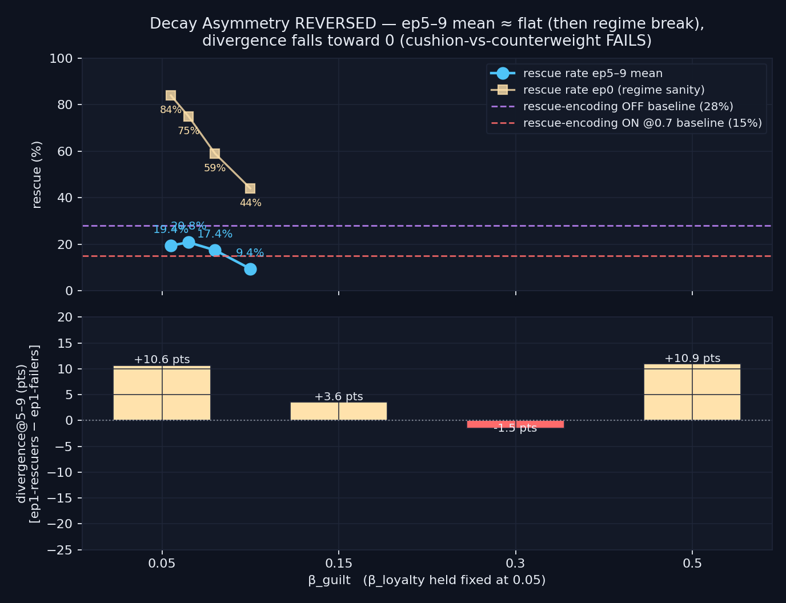

# Decay Asymmetry REVERSED — `decay_asymmetry_reversed_v1`

> **Result: hypothesis FAILED.** Reversing the 2026-05-05 sweep (β_loyalty=0.05 fixed, sweep β_guilt) does NOT produce the predicted monotone GROWTH in divergence@5–9. Instead divergence drifts from +10.6 pts at symmetric mild decay toward 0 (β_guilt=0.30: −1.5 pts), then the β_guilt=0.50 cell breaks the committed regime entirely (ep0 collapses 84% → 44%). The cushion-vs-counterweight interpretation of the prior finding is falsified; the operative mechanism is "any imbalance erases experience-driven type formation," not directional guilt-vs-loyalty asymmetry.

**Date:** 2026-05-06 · **Episodes:** 4,000 · **Runtime:** ~1.5s

## The hypothesis

The 2026-05-05 `decay_asymmetry` sweep showed divergence@5–9 invert sign monotonically (+13.3 → −18.8 pts) as β_loyalty grew from 0.05 to 0.50 with β_guilt held at 0.05. `findings_v3` interpreted this as a **loyalty-cushion vs guilt-counterweight** mechanism: the loyalty side of every rescue memory clears fast, leaving the guilt side of every failure memory to dominate recall, so ep1-rescuers no longer differ from ep1-failers in late-chain dynamics.

That interpretation predicts a clean signed contrast under reversal. Hold β_loyalty=0.05 fixed and crank β_guilt: now the GUILT side of every failure memory clears fast, leaving the loyalty side of every rescue memory as the dominant recall pull. Type formation should STRENGTHEN — divergence should grow monotonically positive with β_guilt.

This is the cleanest single falsifier of the 2026-05-05 mechanism story.

## What actually happened

Sweep: `β_guilt ∈ {0.05, 0.15, 0.30, 0.50}` with `β_loyalty` held at 0.05; κ=1.0, T_snap=12, severity=1.0, `positive_encoding=True`, `rescue_importance=0.7`, chain_length=10, n_agents=100.

| β_guilt | ep0 | ep1 | ep5 | ep9 | **ep5–9 mean** | divergence@5–9 |
|---:|---:|---:|---:|---:|---:|---:|
| 0.05 (symmetric) | 84.0% | 17.0% | 15.0% | 20.0% | **19.4%** | **+10.6 pts** |
| 0.15 | 75.0% | 10.0% | 23.0% | 22.0% | **20.8%** | +3.6 pts |
| 0.30 | 59.0% | 5.0% | 14.0% | 17.0% | **17.4%** | −1.5 pts |
| 0.50 (extreme) | 44.0% | 3.0% | 11.0% | 11.0% | **9.4%** | +10.9 pts |

Three observations break the prior interpretation. First, divergence does NOT grow with β_guilt. It DROPS toward zero across the first three cells (+10.6 → +3.6 → −1.5 pts) — the same erosion pattern as the original sweep, just with smaller amplitude. Second, the symmetric control cell (β_guilt=β_loyalty=0.05) reproduces the divergence sign and magnitude of the prior sweep's symmetric cell within sampling noise (+10.6 vs +13.3 pts), confirming the experimental setup is consistent. Third, the extreme cell (β_guilt=0.50) is in a different dynamic regime entirely — ep0 rescue rate drops from 84% to 44%, indicating the seeded abandonment-prior memory's guilt charge is being stripped fast enough during the first episode itself to disrupt the committed-regime baseline. The +10.9 pts divergence in that cell cannot be compared to the others because the underlying baseline rescue rate is different (9.4% vs ~20%).

## Mechanism (interpretation)

The cleanest reading is that the 2026-05-05 mechanism story was wrong in detail. **"Imbalance breaks differentiation"** is the right framing — both directions of asymmetric forgiveness erode divergence@5–9, just with different amplitudes and different secondary effects.

Why the amplitudes differ: the prior sweep's β_loyalty=0.50 cell hit −18.8 pts divergence while this sweep's β_guilt=0.30 cell only reaches −1.5 pts. That is consistent with the rescue memory carrying a SMALLER emotion magnitude than the seeded abandonment-prior memory carries on its guilt channel. Decaying loyalty fast removes the rescue-memory cushion entirely; decaying guilt fast at moderate rates partially weakens the prior's pull but doesn't erase it. So the "type-erasure" effect is real in both directions but stronger in the original direction.

Why β_guilt=0.50 breaks the regime: a 0.50 per-step decay rate clears stored guilt to ~0.0001 in 8 steps. The seeded abandonment memory has preage=15 and an injected guilt charge that decays during the deliberation steps of episode 0 itself. By mid-episode the seeded prior has minimal recall pull, so the agent loses its committed-regime grip on the rescue action and ep0 rescue rate falls from 84% (symmetric) to 44%. This is not a refutation of the boomerang — it is a regime change. The extreme cell exits the committed regime altogether.

The new mid-cell finding worth banking is that uniform mild decay (β=0.05 symmetric) is again the only condition where the population shows positive ep1-driven divergence (+10.6 pts here, +13.3 pts in the prior sweep). Two independent runs at the symmetric cell now point the same way: **symmetric mild forgiveness is the single forgiveness regime under which experience-driven type formation emerges in this framework**.

## Implication for the framework

The cushion-vs-counterweight interpretation of decay_asymmetry should be retired. The robust pattern is:

- Symmetric mild decay (β=0.05 both sides): preserves +10–13 pts divergence — the only experience-driven type signal we have.
- Asymmetric decay (either direction, moderate magnitude): erodes divergence toward 0.
- Extreme guilt-side decay: changes the regime, takes the agent out of the committed boomerang and into something more like the rational regime (low rescue rate by lost-grip, not by paralysis).

Next levers worth pulling have been moved to the top of the queue: the count-side intervention (`memory_consolidation` / `memory_capacity`) and the recall-event-trace sub-study, which would localize whether divergence is mediated by per-class memory weight or by the timing of memory reactivations within deliberation.

Follow-up questions queued from this run:

- Does the divergence-erosion-from-imbalance pattern hold at lower κ (where the boomerang is weaker)? Replication in the κ=0.5 boomerang regime is the cleanest next probe.
- Snapshot the M store at ep5 across cells: count loyalty-vs-guilt memories and their |emotion| magnitudes. Resolves whether divergence-erosion is driven by per-class memory weight as predicted.
- Does the regime-break behavior at β_guilt=0.50 also show up at β_loyalty=0.50 in retrospect — i.e. does ep0 rescue actually degrade at that extreme too? Worth re-checking the prior sweep's ep0 column.

## Files

| File | What it is |
|---|---|
| `README.md` | this scannable summary |
| `finding.md` | longer mechanism + falsifiability discussion |
| `results.csv` | raw per-episode rows (4,000 rows) |
| `decay_asymmetry_reversed.png` | two-panel chart: ep5–9 mean rescue with ep0 overlay (top) and divergence@5–9 (bottom) |
