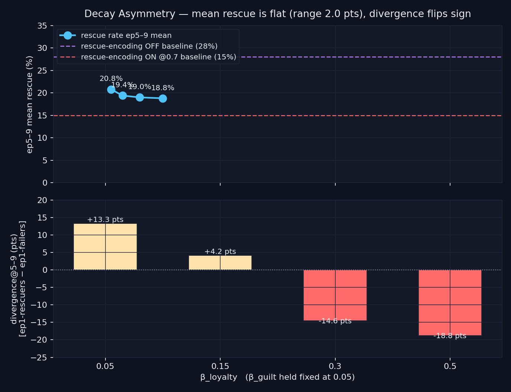

# Decay Asymmetry — `decay_asymmetry_v1`

> **Result: hypothesis FAILED in opposite direction.** Decaying loyalty memories faster than guilt memories does NOT lift mean rescue rate (range 2.0 pts across the entire β_loyalty sweep) and it INVERTS the population-divergence signature — from +13.3 pts at symmetric mild decay to −18.8 pts at extreme asymmetry.

**Date:** 2026-05-05 · **Episodes:** 4,000 · **Runtime:** ~1.5s

## The hypothesis

The 2026-05-02 *Loyalty Boomerang* showed that encoding rescue memories cuts long-term rescue rate roughly in half at κ=1.0 (15% ON vs 28% OFF). The 2026-05-04 `loyalty_importance_floor` null then ruled out per-encoding *importance* as the lever. That left **stored-emotion decay rate** as the next-most-likely dial: faster decay on the loyalty channel than on the guilt channel ("forgiveness for self, not others") should bleed the loyalty payload out of the γ·|emotion| recall term while leaving the seeded guilt prior intact, recovering rescue capacity over a chained run.

## What actually happened

Sweep: `β_loyalty ∈ {0.05, 0.15, 0.30, 0.50}` with `β_guilt` held at 0.05; κ=1.0, T_snap=12, severity=1.0, `positive_encoding=True`, `rescue_importance=0.7`, chain_length=10, n_agents=100.

| β_loyalty | ep0 | ep1 | ep5 | ep9 | **ep5–9 mean** | divergence@5–9 |
|---:|---:|---:|---:|---:|---:|---:|
| 0.05 (symmetric) | 69.0% | 6.0% | 20.0% | 25.0% | **20.8%** | **+13.3 pts** |
| 0.15 | 76.0% | 6.0% | 17.0% | 19.0% | **19.4%** | +4.2 pts |
| 0.30 | 75.0% | 4.0% | 18.0% | 18.0% | **19.0%** | −14.6 pts |
| 0.50 (extreme) | 74.0% | 0.0% | 19.0% | 23.0% | **18.8%** | **−18.8 pts** |

Two things matter here. First, the headline metric is essentially noise — the ep5–9 mean rescue rate stays in a 2.0-pt band across a 10× range of β_loyalty, and never gets within 7 pts of the 28% rescue-encoding-OFF baseline. Asymmetric decay does not raise the mean.

Second, the divergence@5–9 metric (rescue rate of ep1-rescuers minus rescue rate of ep1-failers) **monotonically flips sign** as β_loyalty grows: from +13.3 pts at symmetric mild decay to −18.8 pts at the extreme cell. Symmetric mild forgiveness preserves positive type formation; asymmetric forgiveness destroys it and replaces it with a clear anti-type pattern.

## Mechanism (interpretation)

The 2.0-pt flatness on the headline reproduces the structural lock-in seen in `loyalty_importance_floor`: the rescue memory's *existence* in the store appears to be sufficient to cap mean rescue rate at ~15–20% in the chained-memory regime, regardless of how loud or emotion-charged it is.

The divergence inversion is the new signal. With β_loyalty=β_guilt=0.05, BOTH channels of every encoded memory bleed at the same modest rate. Agents who happen to rescue early build a small loyalty cushion that decays in lockstep with the guilt their failures encode — the early difference survives the chain. As β_loyalty rises, the loyalty side of every rescue memory clears within a few steps while the guilt side of every failure persists. Agents that rescued in ep1 still pay the full guilt-accumulation cost from any failures in ep2–ep4 but no longer carry the corresponding rescue-memory weight as a counterweight. The result: **the harshest forgiveness regime ("forget your virtue, hold your sins") is the one that most thoroughly erases the consequence of the early outcome**. Asymmetric forgiveness imitates a maximally self-critical personality — and in this framework, that personality is *less* differentiated by experience, not more.

## Implication for the framework

The boomerang is now resistant to two distinct interventions (importance throttling, asymmetric decay), each of which targets a different recall-impact term in `MemoryImpact = exp(−β·age)·exp(α·imp)·exp(γ·|emotion|)·sim(ctx,mem)`. The next levers are either *count-side* (memory eviction / consolidation, queued as `memory_capacity`) or the *similarity-side* — possibly the recall-event-trace sub-study would clarify which contexts trigger the rescue-memory firings.

A subsidiary observation worth banking: **uniform mild stored-emotion decay at β=0.05** is the only condition tested in this sweep where ep1 outcome predicts ep5–9 outcome with a positive sign. That cell is also the only one where the population shows experience-driven differentiation. This is a small but non-trivial result on its own — the framework can produce experience-driven types ONLY under symmetric mild forgiveness, and only at +13 pts of divergence (still well below the +50–70 pts characteristic of human-like personality drift).

Follow-up questions:

- Does the divergence inversion persist at lower κ (where the boomerang is weaker)?
- Does β=0.05 symmetric also lift divergence in the κ=0.5 regime, suggesting a generic "uniform forgiveness preserves type formation" effect?
- Does asymmetric decay in the OPPOSITE direction (β_guilt > β_loyalty, "forgive yourself, not others") restore positive divergence?

## Files

| File | What it is |
|---|---|
| `README.md` | this scannable summary |
| `finding.md` | longer mechanism + falsifiability discussion |
| `results.csv` | raw per-episode rows (4,000 rows) |
| `decay_asymmetry.png` | two-panel chart: ep5–9 mean rescue (top) and divergence@5–9 (bottom) |
