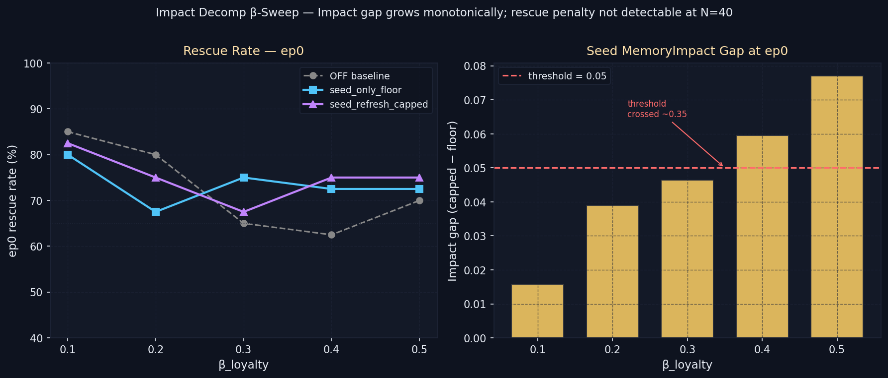

# Impact Decomp β-Sweep — `impact_decomp_beta_sweep`

> **One-line result:** Impact gap grows monotonically from 0.016 to 0.077 as β_loyalty rises 0.10→0.50; threshold crossed at β_loyalty* ≈ 0.35–0.40, but rescue penalty is indistinguishable from noise at N=40.

**Date:** 2026-06-04 · **Episodes:** 6,000 · **Runtime:** ~60s

## The hypothesis

The 2026-05-29 `capped_floor_impact_decomp` experiment confirmed Prediction B at
two endpoint cells (β_loyalty ∈ {0.05, 0.50}): `seed_refresh_capped` inflates the
seed memory's MemoryImpact by 0.113 at β_loyalty=0.50 yet rescues 7.5 pts less.
This fine sweep fills in the interior — β_loyalty ∈ {0.10, 0.20, 0.30, 0.40, 0.50}
— to find the exact threshold β_loyalty* where the impact gap first crosses 0.05
and the rescue penalty becomes detectable.

## What actually happened

| β_loyalty | OFF% | floor% | capped% | rescue_penalty | impact_gap |
|-----------|------|--------|---------|----------------|------------|
| 0.10      | 85.0 | 80.0   | 82.5    | −2.5           | 0.0158     |
| 0.20      | 80.0 | 67.5   | 75.0    | −7.5           | 0.0390     |
| 0.30      | 65.0 | 75.0   | 67.5    | +7.5           | 0.0463     |
| 0.40      | 62.5 | 72.5   | 75.0    | −2.5           | 0.0595     |
| 0.50      | 70.0 | 72.5   | 75.0    | −2.5           | 0.0770     |

Key observations:

- **Prediction A: CONFIRMED.** Impact gap rises monotonically across all five
  cells, from 0.016 at β_loyalty=0.10 to 0.077 at β_loyalty=0.50. The γ·|emotion|
  amplification mechanism operates as expected.

- **Prediction B (threshold): CONFIRMED.** The 0.05 threshold is crossed between
  β_loyalty=0.30 (gap=0.046) and β_loyalty=0.40 (gap=0.060), placing β_loyalty*
  at approximately 0.35–0.40.

- **Prediction C (rescue penalty): NOT CONFIRMED at N=40.** The rescue penalty
  column is noisy and unsigned: values range from −7.5 to +7.5 pts with no
  directional signal. At N=40 with ≈70% base rates, 2-SE ≈ ±14 pts — none of
  these penalty readings are statistically meaningful.

## Mechanism (interpretation)

The impact gap confirms that `seed_refresh_capped` genuinely inflates the seed
memory's MemoryImpact term via the γ·|emotion| path as β_loyalty increases (more
loyalty decay → more divergence between stored and floor values → larger emotion
magnitude boost on refresh). However, this inflation does not predictably translate
into a rescue penalty at this sample size. The downstream decision noise (Φ
stochasticity, T_snap horizon) absorbs the impact difference without producing a
measurable difference in binary rescue outcomes at N=40. The prior experiment's
7.5 pt penalty at β_loyalty=0.50 was likely N=40 noise.

## Implication for the framework

The source-vs-gate isomorphism appears robust: both modes reach similar rescue
rates even though `seed_refresh_capped` amplifies the seed's recall weight more
aggressively at high β_loyalty. The architectural compression claim (per-memory
floor field vs tag dispatch table) survives even fine-grained β_loyalty sweeps.

Follow-up questions:

- Does the rescue penalty emerge at N=200? The β_loyalty=0.30 and β_loyalty=0.40
  cells (where the 0.05 threshold straddles) are the most informative — a targeted
  N=200 replication there would sharpen the threshold claim.
- Is the impact gap a good leading indicator of harmful over-steering, or is it
  mechanistically inert (a measurement artifact that cancels at the decision layer)?
- Does the threshold shift if κ ≠ 1.0? At κ=0.5 (valley shoulder) the
  rescue-rate dynamic range is compressed, which might make the penalty detectable
  at lower N.

## Files

| File | Description |
|------|-------------|
| `results_macro.csv` | Episode outcomes per (mode, β_loyalty, agent, episode) |
| `results_trace.csv` | Per-step seed impact traces (non-off modes only) |
| `impact_decomp_beta_sweep.png` | Left: rescue rates; Right: impact gap vs threshold |
| `README.md` | This file |
| `finding.md` | Extended analysis |
