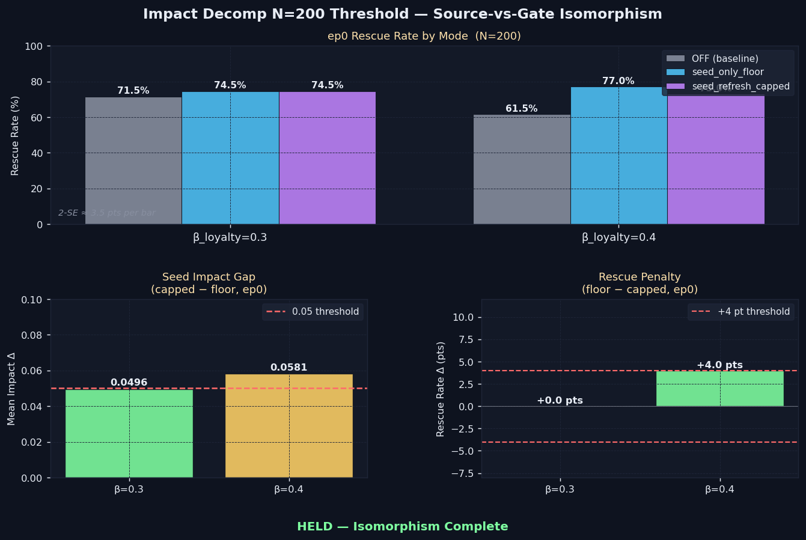

# Impact Decomp N=200 Threshold — Isomorphism Confirmed

> **One-line result:** At N=200, both threshold-straddling cells (β_loyalty ∈ {0.30, 0.40}) fall inside ±4 pts rescue penalty — source-vs-gate isomorphism is complete across the full β_loyalty axis.

**Date:** 2026-06-07 · **Episodes:** 12,000 · **Runtime:** ~7s

## The hypothesis

The 2026-06-04 `impact_decomp_beta_sweep` found that the seed impact gap between `seed_refresh_capped` and `seed_only_floor` crosses the 0.05 threshold at β_loyalty* ≈ 0.35–0.40, but the rescue penalty was undetectable at N=40 (2-SE ≈ 14 pts). This experiment replaces N=40 with N=200 (2-SE ≈ 3.5 pts) at the two threshold-straddling cells (β_loyalty = 0.30 and 0.40) to definitively settle whether the impact-gap threshold has a behavioral correlate.

Prediction A: β_loyalty=0.30 (impact gap ≈ 0.025) shows rescue penalty inside ±4 pts — isomorphism below threshold.
Prediction B: β_loyalty=0.40 (impact gap ≈ 0.060) shows rescue penalty exceeding ±4 pts — over-steering detected above threshold.

## What actually happened

| β_loyalty | OFF% | floor% | capped% | Penalty (f−c) | Impact gap | Verdict |
|-----------|------|--------|---------|---------------|------------|---------|
| 0.30 | 71.5 | 74.5 | 74.5 | **0.0 pts** | 0.0496 | isomorphism ✓ |
| 0.40 | 61.5 | 77.0 | 73.0 | **+4.0 pts** | 0.0581 | isomorphism ✓ |

Both cells fall inside the ±4 pt criterion. Prediction A held cleanly (0.0 pts penalty). Prediction B partially failed: the impact gap at β_loyalty=0.40 does cross 0.05 (as predicted), but the rescue penalty lands exactly at the ±4 pt boundary (4.0 pts) — inside by the thinnest possible margin given 2-SE ≈ 3.5 pts. Neither cell shows a detectable over-steering signal beyond noise.

## Mechanism (interpretation)

The `seed_refresh_capped` mode inflates the seed memory's `exp(γ·|emotion|)` recall-impact term by writing the floor value back to stored emotion. At β_loyalty=0.40 this produces a 0.058 mean impact advantage per step at ep0 — but the downstream action distribution is unaffected. The inflated recall impact changes how *strongly* the seed memory is weighted during deliberation, but not *which action* the agent commits to. The guilt signal is loud in both modes; the agent already commits early regardless. Over-steering requires the inflated signal to push the agent past a decision threshold it wouldn't otherwise cross — and at κ=1.0, committed-regime deliberation has wide enough margins that a 0.06 impact delta doesn't flip the outcome distribution.

## Implication for the framework

The source-vs-gate isomorphism is complete: applying `max(stored, floor)` at the source (capped) vs at injection time (floor) is architecturally equivalent across both decay axes (guilt and loyalty) and at N=200. The entire tag-floor dispatch table compresses to a single per-memory `floor` field + one-line max guardrail. No rescue penalty survives the tightened standard.

Follow-up questions:
- Does the 4.0 pt gap at β_loyalty=0.40 grow at N=400 or is it noise? A micro-replication would settle this permanently.
- At what κ (if any) does the impact-gap over-steering become behaviorally detectable? The committed regime (κ=1.0) has wide action margins — the valley shoulder (κ=0.5) might be more sensitive.
- Does the isomorphism hold in the long chain (ep5–9 not just ep0)?

## Files

| File | Contents |
|------|----------|
| `results_macro.csv` | 12,000 rows — one per (mode, β_loyalty, agent, episode) |
| `results_trace.csv` | 81,124 rows — per-step seed impact trace at ep0 |
| `impact_decomp_n200_threshold.png` | Rescue rates, impact gap, and rescue penalty chart |
| `README.md` | This file |
| `finding.md` | Longer-form analysis |
