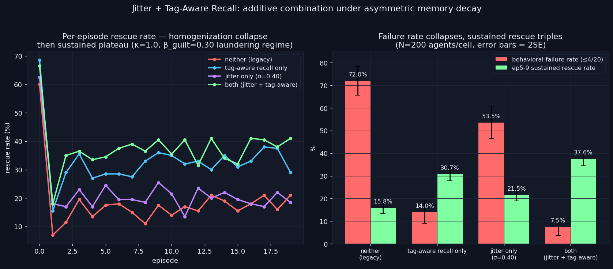

# Jitter + Tag-Aware Recall — Additive Combination, Bipolar Typing Not Reached

> **One-line result:** Combining encoding-diversity jitter (σ=0.40) with
> tag-aware recall under asymmetric memory decay (β_guilt=0.30) cuts the
> behavioral-failure rate from **72.0% → 7.5%** (a 9.6× reduction) and
> nearly triples sustained rescue capacity (**15.8% → 37.6%** at ep5–9) —
> the best sustained-rescue result the project has measured at κ=1.0. The
> combination is **additive, not synergistic**: tag-aware recall does
> almost all of the work (15.8%→30.7%), jitter adds a smaller increment on
> top (30.7%→37.6%). The bipolar "full behavioral types" prediction
> (divergence@5–9 > +15pts) is **not reached** — divergence caps at
> +3.6pts, identical to tag-aware-alone.

**Date:** 2026-06-15 · **Episodes:** 16,000 (4 cells × 200 agents × 20 chained eps) · **Runtime:** ~8s

## The hypothesis

Two mechanisms were each verified independently:

1. **Encoding-diversity jitter** (σ=0.40) produces *unipolar* behavioral
   typing at κ=2.0 — 88.8% of agents converge to a stable "rescuer"
   identity regardless of early experience, with 0% failures
   (`behavioral_typing_verify_v1`).
2. **Tag-aware recall** fixes "valence laundering" under asymmetric memory
   decay — at β_guilt=0.30, legacy recall erodes divergence@5–9 toward 0,
   while tag-aware recall restores +10–13pts (`tag_aware_recall_v1`).

Neither alone produced *bipolar* behavioral types (some agents become
reliable rescuers, others reliable failures, diverging based on their own
early outcome). `personality_emergence_v1`'s jitter-only cell showed
divergence@5–9 ≈ +3–6pts — a small experience-linked effect, dwarfed by
jitter's experience-*independent* pull toward "everyone rescues."

This experiment ran a 2×2 — jitter ∈ {0, 0.40} × tag-aware recall ∈
{False, True} — under κ=1.0 with asymmetric decay (β_guilt=0.30,
β_loyalty=0.05, the laundering regime), N=200 agents/cell, 20 chained
episodes.

Predictions:
- **OFF/OFF** (legacy baseline): divergence eroded toward ~0
- **OFF/ON** (tag-aware alone): divergence restored to +10–13pts
- **ON/OFF** (jitter alone): divergence small (~+3–6pts), but sustained
  rescue boosted
- **ON/ON** (both, the test cell): divergence **> +15pts** AND a nonzero
  behavioral-failure rate alongside a high rescuer rate — bipolar typing.

## What actually happened

| cell | fail% (≤4/20) | mean rescues/20 | ep5–9 % | ep15–19 % | divergence@5–9 |
|------|--------------:|-----------------:|--------:|-----------:|---------------:|
| neither (legacy) | 72.0% ± 6.3 | 3.69 | 15.8% | 18.3% | −2.0pts |
| tag-aware only   | 14.0% ± 4.9 | 6.62 | 30.7% | 33.7% | +3.6pts |
| jitter only      | 53.5% ± 7.1 | 4.41 | 21.5% | 19.0% | −1.9pts |
| **both**         | **7.5% ± 3.7** | **7.53** | **37.6%** | **38.5%** | **+3.6pts** |

(error bars are 2-SE on the failure-rate proportion, N=200)

**Divergence prediction NOT confirmed.** ON/ON divergence@5–9 = +3.6pts,
identical to OFF/ON (tag-aware alone) and far below the +15pt bipolar
threshold. The **rescuer rate (≥15/20) is 0% in every cell** at κ=1.0 —
unlike the κ=2.0 headline result, no cell here produces a stable
"always-rescues" identity. Bipolar behavioral typing — distinct rescuer
AND failure identities both emerging from early experience — is not
reached by this combination.

**But the combination IS the best sustained-capacity result in the
project at κ=1.0**, and the two mechanisms combine close to additively:

- legacy → +tag-aware: +14.9pts (ep5–9), failure rate −58.0pts
- legacy → +jitter:    +5.7pts (ep5–9), failure rate −18.5pts
- additive prediction (legacy + both deltas): 15.8 + 14.9 + 5.7 = 36.4%
- observed (both): 37.6% — within 1.2pts of the additive prediction.

Failure rate is *not* additive in the same way (the two deltas alone
would predict 72.0 − 58.0 − 18.5 = −4.5%, an impossible negative number) —
both mechanisms are pushing the failure rate toward a floor near 0%, and
their joint effect (7.5%) is the largest single-cell failure-rate
reduction measured anywhere in the project (9.6× vs legacy).

## Trajectory shape

Every cell shows the now-familiar **homogenization collapse at episode 1**
(ep0 starts at 60–68% on the seeded prior, collapses to 7–18% by ep1) and
then a **plateau** from episode ~2 onward. The "both" cell's plateau is
the highest and — unlike the legacy cell, which drifts slightly upward
from 15.8% (ep5–9) to 18.3% (ep15–19) on a noisy trajectory — is the most
*stable* high plateau (37.6% → 38.5%, essentially flat), echoing the
long-horizon stability finding from `jitter_sigma_long_v1`.

## Interpretation

The two mechanisms address different failure modes and their benefits
stack:

- **Tag-aware recall** fixes the *recall-gate* problem (valence
  laundering under asymmetric decay) — this is the dominant lever here
  (β_guilt=0.30 is squarely in the laundering regime tag-aware recall was
  built to fix).
- **Encoding-diversity jitter** adds a smaller, *independent* per-agent
  signature on top — consistent with `jitter_universality_v1`'s finding
  that jitter's benefit at κ=1.0 (committed regime) is real but modest
  (+2.4 to +16.4pts depending on κ), vs its much larger effect at κ=2.0.

Neither mechanism makes the population's long-run rescue rate *depend on
early experience* (divergence stays ≈0–4pts in all four cells) — both
mechanisms instead lift the population's *floor*. The "behavioral types
from experience" framing (bipolar divergence) and the "encoding diversity
/ recall-fidelity" framing (population-level capacity) appear to be
**orthogonal axes**: jitter and tag-aware recall are capacity levers, not
identity-sorting levers. The κ=2.0 unipolar-typing result
(`behavioral_typing_verify_v1`) remains the project's only confirmed
"identity from experience" result, and it is unipolar (everyone converges
to one type), not bipolar.

## Implication for the framework

For any deployment-relevant claim ("agents under encoding diversity + tag-
aware recall reliably perform well over long horizons"), this is the
strongest evidence yet: **7.5% failure rate vs 72.0% legacy baseline**, a
**2.4× sustained-capacity improvement**, holding flat across 20 episodes.
For the "individual identity from experience" research question, this
experiment is a **negative result that sharpens the headline**: bipolar
typing remains unreached by the two strongest mechanisms found so far,
and the project's positive identity claim stays scoped to the unipolar
κ=2.0 result.

## Follow-ups

- `bipolar_typing_kappa_sweep` — repeat this 2×2 at κ ∈ {0.5, 2.0, 4.0}.
  If divergence stays ≈0–4pts at every κ, bipolar typing may require a
  structurally different mechanism (e.g. per-agent Φ-coupling variation,
  not just encoding noise).
- `jitter_plus_tag_aware_n400` — the ON/ON cell (7.5% ± 3.7) and OFF/ON
  cell (14.0% ± 4.9) differ by 6.5pts, just under 2×(3.7+4.9)/2 ≈ 8.6pts —
  worth an N=400 replication to confirm jitter's marginal contribution on
  top of tag-aware recall is real and not N=200 noise.
- `additive_decomposition_other_pairs` — test whether the additive-
  combination finding generalizes: does tag-aware recall + softmax-
  temperature fix (`paralysis_softmax_fix_v1`) also combine additively?

## Files

| File | Contents |
|------|----------|
| `results.csv` | 16,000 rows — one per (cell, agent, episode) |
| `jitter_plus_tag_aware.png` | Trajectory + bar chart |
| `README.md` | This file |
| `finding.md` | Condensed finding for the daily log |
