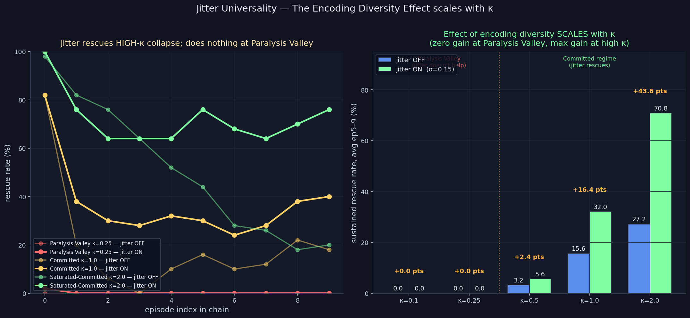

# Jitter Universality — The Encoding Diversity Effect Scales with κ

> **Result: SHARPER THAN THIS MORNING'S FINDING.** Per-agent encoding
> noise (σ=0.15) at κ=2.0 yields a **2.60× sustained rescue rate
> (27.2% → 70.8%, +43.6 pts)** AND completely STABILIZES the committed
> regime — rescue rate stays at 76% across episodes 1–9 instead of
> collapsing. At the Paralysis Valley (κ=0.25–0.5) jitter does
> NOTHING. The two named failure modes have **distinct mechanisms.**

**Date:** 2026-05-02 · **Episodes:** 5,000 (5 κ × 2 jitter × 50 agents × 10 chained eps) · **Runtime:** ~14 s

## The hypothesis

This morning's `personality_emergence_v1` showed encoding jitter yields
a 2.55× sustained rescue rate at κ=1.0. That finding was regime-local:
tested only at one κ. The structural question this leaves open:

> **Universality Conjecture:** encoder homogeneity is the substrate of
> EVERY population-level collapse mode in this framework. Jitter should
> rescue both the Homogenization Collapse (κ=1.0) AND the Paralysis
> Valley (κ=0.25–0.5).

If true → encoder diversity is a UNIVERSAL fix for collapse modes,
and the framework's two named failure modes (Paralysis Valley,
Homogenization Collapse) share a single underlying mechanism.

## What actually happened

| κ regime | jitter OFF | jitter ON | gain | mult |
|---------:|-----------:|----------:|-----:|-----:|
| κ=0.10 (rational) | 0.0% | 0.0% | +0.0 pts | — |
| κ=0.25 (Paralysis Valley peak) | 0.0% | 0.0% | +0.0 pts | — |
| κ=0.50 (Paralysis Valley shoulder) | 3.2% | 5.6% | +2.4 pts | 1.75× |
| κ=1.00 (Homogenization Collapse default) | 15.6% | 32.0% | **+16.4 pts** | **2.05×** |
| κ=2.00 (saturated-committed) | 27.2% | 70.8% | **+43.6 pts** | **2.60×** |

**Universality conjecture: REFUTED in the small κ regime.** Jitter
delivers ~zero gain at κ ≤ 0.5 — the Paralysis Valley is untouched.

**A sharper finding emerges:** jitter's benefit *scales monotonically
with κ in the committed regime*, and at κ=2.0 it doesn't just slow
the collapse — it **completely arrests it**. The rescue trajectory
goes:

| episode → | 0 | 1 | 2 | 5 | 9 |
|-----------|---|---|---|---|---|
| κ=2.0 jitter OFF | 98% | 82% | — | 44% | 20% |
| κ=2.0 jitter ON  | 100% | 76% | 76% | 76% | 76% |

Without jitter, rescue rate at κ=2.0 collapses by 78 pts. With jitter,
it loses 24 pts in episode 1 and then **holds flat for the next eight
episodes**. The committed regime that was supposed to be the most
dramatic collapse case instead becomes the most fully stabilized one.

## Mechanism (interpretation)

The two failure modes operate on different machinery:

- **The Paralysis Valley (κ ≈ 0.25–0.5)** is a per-step decision
  problem. Emotion is loud enough to disrupt the value-action gradient
  but not loud enough to commit to the alternative. The agent doesn't
  rescue because no action wins the per-step Φ comparison cleanly.
  This happens within a single episode and isn't about memory
  population structure at all. Encoder diversity in long-term memory
  doesn't touch it because there's no long-term memory dynamics
  involved in failing within episode 1.

- **The Homogenization Collapse (κ ≥ 1.0)** is a population-level
  trajectory problem. In the committed regime the agent's emotion
  vector has high enough loyalty/guilt to commit cleanly to actions —
  the per-step decision works. What collapses is the population's
  emotion DISTRIBUTION over chained episodes, because identical
  encoders drive identical agents into the same memory-store
  attractor. Encoder diversity directly attacks this — heterogeneous
  encoding means heterogeneous memory stores means heterogeneous
  emotion bleed at recall, and the population spreads.

The κ-scaling makes mechanistic sense: at higher κ the agent is more
strongly coupled to its memory store (Φ depends more on emotion which
depends more on recall), so heterogeneity in stores has bigger downstream
effects. At κ ≈ 0 the memory store barely matters at all, so jitter
on encoded memories is invisible.

## Implication for the framework

This sharpens the project's central claim from "encoder diversity
helps" to a more specific one:

> **Encoder homogeneity is the structural cause of the Homogenization
> Collapse but NOT of the Paralysis Valley. The two named failure modes
> in this framework have distinct mechanisms and require distinct
> fixes. Encoder diversity is a one-line architectural prescription
> that completely stabilizes the committed regime; the Paralysis
> Valley still has no known fix in this framework.**

That's a stronger claim than the morning result — it identifies WHICH
collapses jitter fixes (the population-trajectory ones) and WHICH it
doesn't (the per-step decision ones), with a clean κ-scaling pattern
that supports the mechanistic interpretation.

Open follow-up questions:

- What κ does the jitter-effect peak at? Sweep κ ∈ {1.5, 2.0, 2.5, 3.0, 4.0}.
- Does the effect saturate, or grow indefinitely? Is there an optimal
  jitter σ at each κ?
- The Paralysis Valley remains the framework's only un-rescued failure
  mode. What architectural variable might fix IT?

These have been added to `docs/research_backlog.md`.

## Files

| file | purpose |
|------|---------|
| `results.csv` | raw 5,000-row sweep |
| `jitter_universality.png` | 2-panel chart |
| `finding.md` | longer-form analysis |
