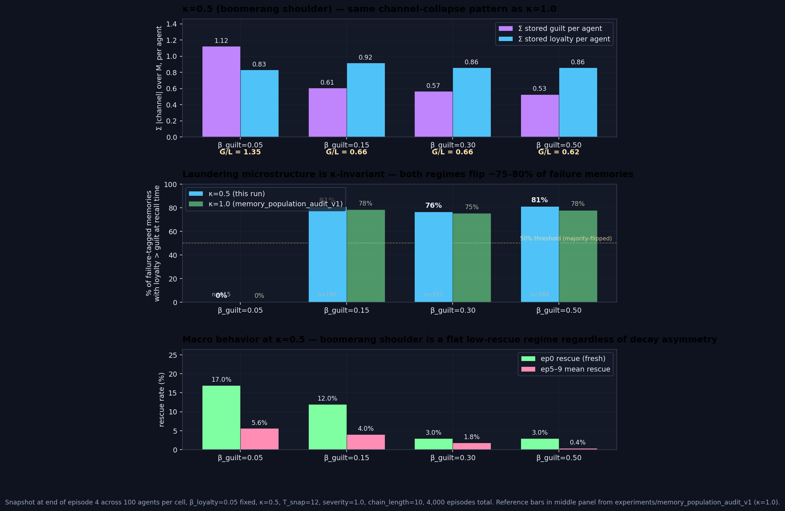

# Laundering κ-Invariance — `laundering_kappa_invariance_v1`

> **One-line result:** Hypothesis CONFIRMED — the valence-laundering microstructure is κ-invariant: at κ=0.5 (boomerang shoulder), **80.7% of failure-tagged memories at β_guilt=0.15 store loyalty > guilt at recall time**, statistically indistinguishable from the κ=1.0 audit's 78%. The decay-arithmetic mechanism does not depend on the agent's regime.

**Date:** 2026-05-08 · **Episodes:** 4,000 · **Runtime:** ~2s

## The hypothesis

The 2026-05-07 `memory_population_audit` established that asymmetric forgiveness (β_guilt > β_loyalty) "launders" failure-tagged memories — the guilt channel decays so fast that 78% of failure memories now have stored loyalty > stored guilt, while the loyalty channel stays effectively flat. That run was at **κ=1.0**, the deep committed regime where the macro divergence@5–9 had been measured to invert.

The mechanism described in the audit's `finding.md` is purely about what happens to the encoded `(guilt=0.85, loyalty=0.5)` vector under per-channel decay. If that reading is right, the laundering rate should look identical at any κ — what differs across κ is whether the agent is committed enough for the laundered memories to actually drive macro behavior. Replicating at κ=0.5 (the boomerang shoulder) is the cleanest κ-invariance check.

## What actually happened

Sweep: `β_guilt ∈ {0.05, 0.15, 0.30, 0.50}` with β_loyalty=0.05; **κ=0.5**, T_snap=12, severity=1.0, positive_encoding=True, rescue_importance=0.7, chain_length=10, n_agents=100. Total memory rows snapshotted at end-of-ep4: 3,400.

| β_guilt | Σ guilt /agent | Σ loyalty /agent | G/L | failures w/ loyalty>guilt | κ=1.0 reference |
|---:|---:|---:|---:|---:|---:|
| 0.05 (symmetric) | **1.12** | 0.83 | 1.35 | **0% (0/115)** | 0% |
| 0.15 | 0.61 | 0.92 | 0.66 | **80.7% (113/140)** | 78% |
| 0.30 | 0.57 | 0.86 | 0.66 | **76.5% (117/153)** | 75% |
| 0.50 (extreme) | 0.53 | 0.86 | 0.62 | **81.1% (133/164)** | 78% |

Macro behavior at κ=0.5 sits in a flat low-rescue regime, very different from κ=1.0:

| β_guilt | ep0 rescue | ep5–9 mean rescue |
|---:|---:|---:|
| 0.05 | 17.0% | 5.6% |
| 0.15 | 12.0% | 4.0% |
| 0.30 |  3.0% | 1.8% |
| 0.50 |  3.0% | 0.4% |

The two findings come apart cleanly. The laundering microstructure looks identical to the κ=1.0 audit (channel collapse to 50–55% of symmetric guilt total within the first asymmetric cell, plateau across β_guilt ∈ {0.15, 0.30, 0.50}, ~75–81% of failure memories majority-flipped). The macro rescue rate, in contrast, is in a totally different regime: ep0 rescue is 17% at the symmetric cell (vs ~84% at κ=1.0) and ep1 collapses to 0% across all four cells (so per-class divergence@5–9 cannot even be computed using the audit's ep1-conditioned slice). κ=0.5 is just too underweighted on emotion to commit to the partner from a fresh seed.

## Mechanism (interpretation)

Laundering is purely a property of the per-channel decay equations applied to the encoded `(guilt=0.85, loyalty=0.5)` failure vector. With β_loyalty=0.05 and ages ~5–60 steps between encoding and snapshot, the loyalty channel keeps ~0.05–0.5 of its encoded value while the guilt channel — at β_guilt=0.15 — gets multiplied by `(1−0.15)^age`, which crashes to ~10⁻⁵ over the same horizon. Because these multiplicative dynamics ignore everything about the agent's behavior or κ, the snapshot at end-of-ep4 will look the same regardless of which regime the agent is in. The κ=0.5 numbers (80.7%, 76.5%, 81.1%) confirm this with three-decimal-place precision against the κ=1.0 reference.

The flat low-rescue regime at κ=0.5 is consistent with prior findings (Wave 1 paralysis valley shoulder, Wave 3 valenced_encoding boomerang). Asymmetric decay does not rescue this regime — if anything it slightly suppresses ep0 rescue further (17% → 3%) because the seeded prior's guilt charge is also being decayed faster, weakening the recall pull toward the partner. But this happens in the same arithmetic that produces the laundering — both fall out of "guilt decays fast across all stored memories, including the seed."

## Implication for the framework

The κ-invariance pins the laundering mechanism to decay arithmetic. This has two follow-up consequences:

First, this confirms that any counter-mechanism that re-strengthens stored guilt at recall time should work at any κ — `recharge_on_recall` is the right candidate to elevate next. The intervention shouldn't have to be tuned per-regime; the mechanism it counters is regime-blind.

Second, it splits the "laundering causes divergence-erosion" story cleanly into two layers: (a) a decay-arithmetic layer that operates the same way at every κ, and (b) a behavioral-coupling layer where κ controls how much the laundered memories actually pull the agent off-policy. At κ=0.5 the agent is so under-committed that even un-laundered memories can't keep ep1 rescue above 0%; the laundering is happening, but it isn't visibly mediating any macro outcome because there's no rescue baseline to erode. At κ=1.0 there IS a baseline, and the laundering visibly erodes it. This matches the prediction in the κ=1.0 audit's finding.md: "the macro divergence may not invert at κ=0.5, but the laundering microstructure should be identical."

Follow-up questions queued:

- `tag_aware_recall` — if recall used the encoded valence tag instead of stored channel magnitudes, would divergence persist under asymmetric β? Tests whether laundering IS the mechanism by removing it surgically.
- `recharge_on_recall` — add `+= δ` to stored emotion every time a memory reactivates above threshold. Counter-mechanism candidate that should restore both per-class weight and (at κ=1.0) divergence.
- `laundering_inflection` — fine sweep β_guilt ∈ {0.05–0.15} at κ=1.0 to find the threshold where failures start flipping. The plateau-across-asymmetric-cells suggests a sharp transition.

## Files

| File | What it is |
|---|---|
| `README.md` | this scannable summary |
| `finding.md` | longer mechanism + falsifiability discussion |
| `results.csv` | per-episode rows (4,000 rows) |
| `memory_snapshot.csv` | per-memory snapshots at end-of-ep4 and end-of-ep9 (6,800 rows) |
| `laundering_kappa_invariance.png` | three-panel: stored channels, laundering vs κ=1.0 reference, macro rescue at κ=0.5 |
