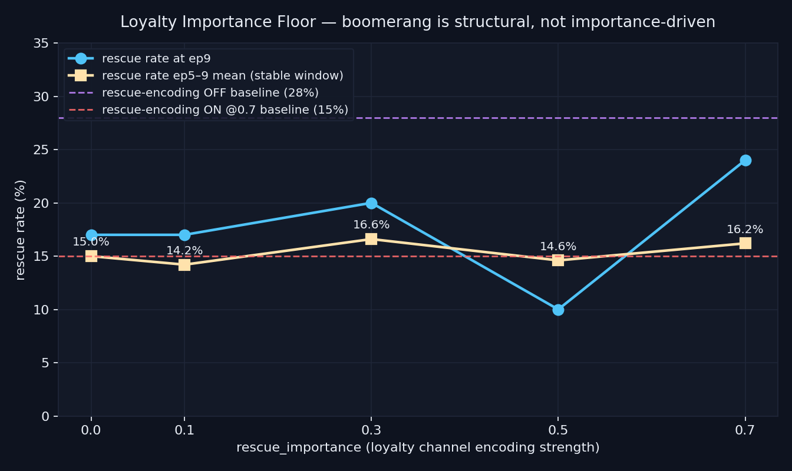

# Loyalty Importance Floor — `loyalty_importance_floor_v1`

> **Result: NULL.** Throttling rescue-side encoding importance from 0.7 down to 0.0 does NOT recover ep9 rescue capacity. The Loyalty Boomerang is structural, not importance-driven.

**Date:** 2026-05-04 · **Episodes:** 5,000 · **Runtime:** ~30s

## The hypothesis

Wave-3's homogenization collapse and the 2026-05-02 *Loyalty Boomerang* finding showed that
turning rescue-side outcome encoding ON (with importance 0.7) actually HALVES long-term
rescue rate vs. turning it OFF (15% vs 28% at ep9, κ=1.0). This run asks whether the
rescue channel can be salvaged by lowering its **importance** rather than removing the
channel altogether — i.e., is there a "low-volume loyalty signal" floor at which a rescue
memory exists in the store but does not over-saturate recall competition?

## What actually happened

Sweep: `rescue_importance ∈ {0.0, 0.1, 0.3, 0.5, 0.7}` × κ=1.0 × T_snap=12 ×
chain_length=10 × 100 agents/cell. `positive_encoding=True` everywhere.

| `rescue_importance` | rescue@ep0 | rescue@ep9 | rescue ep5–9 mean | divergence@5–9 (pts) |
|---:|---:|---:|---:|---:|
| 0.0 | 82.0% | 17.0% | **15.0%** | −10.6 |
| 0.1 | 81.0% | 17.0% | **14.2%** | −6.1 |
| 0.3 | 81.0% | 20.0% | **16.6%** | −5.0 |
| 0.5 | 82.0% | 10.0% | **14.6%** | +2.3 |
| 0.7 | 79.0% | 24.0% | **16.2%** | −6.8 |

The headline window (ep5–9 mean rescue rate) is essentially flat: **range = 2.4 pts** across the
entire importance sweep. None of the cells get within 12 pts of the rescue-encoding-OFF baseline
(28%). Memory-store size at ep9 is 11 in every cell (1 seeded + 10 outcome-encoded), so the
intervention only changed *weight*, not *count*.

Divergence@5–9 (rescue rate of ep1-rescuers minus rescue rate of ep1-non-rescuers) is
**negative or near-zero in every cell**, replicating the boomerang's anti-type signature: agents
who happen to rescue early end up performing WORSE in the stable window than agents who failed
early.

## Mechanism (interpretation)

Two features explain the null:

1. **The store-size effect dominates the importance effect.** Even at `rescue_importance=0.0`,
   the rescue memory still gets appended to M and competes for recall via cosine similarity,
   age, and stored-emotion magnitude (loyalty=0.8 in the rescue payload). Importance enters
   recall as `exp(α · importance)`, a multiplicative term that at importance=0 is just 1 — i.e.
   neutral, not zero. The recall surface is dominated by the loyalty-charged emotion field of
   the rescue memory plus the freshness-weighted competition with the seeded abandonment prior.

2. **Importance is the wrong dial.** The boomerang's mechanism is most likely the contextual
   activation pattern of rescue memories during *non-rescue* episodes: their feature vector
   sits near the rescue-completion state, but recall happens during deliberation steps where
   the agent is closer to the partner-resource decision boundary. A low-importance rescue
   memory still pulls the agent's emotion toward loyalty when it gets reactivated, and that
   pull is what disables the committed-rescuer regime.

## Implication for the framework

If the Loyalty Boomerang doesn't yield to importance throttling, the next levers are
**count** (do not encode at all, or evict competing rescue memories) and **decay rate**
(faster forgetting on the loyalty channel — the queued `decay_asymmetry` experiment).
Follow-ups now actively prioritized:

- `decay_asymmetry` — asymmetric β on guilt vs loyalty memories (next in queue).
- `memory_capacity` (LRU eviction) — does a bounded store break the boomerang by forcing
  rescue memories to age out faster?
- A future experiment ought to look at the recall *event distribution* during a chain — when
  exactly does the rescue memory get reactivated, and does that explain the anti-type signature?

## Files

| File | What it is |
|---|---|
| `README.md` | this scannable summary |
| `finding.md` | longer mechanism + falsifiability discussion |
| `results.csv` | raw per-episode rows (5,000 rows) |
| `loyalty_importance_floor.png` | headline chart with OFF/ON baselines overlaid |
