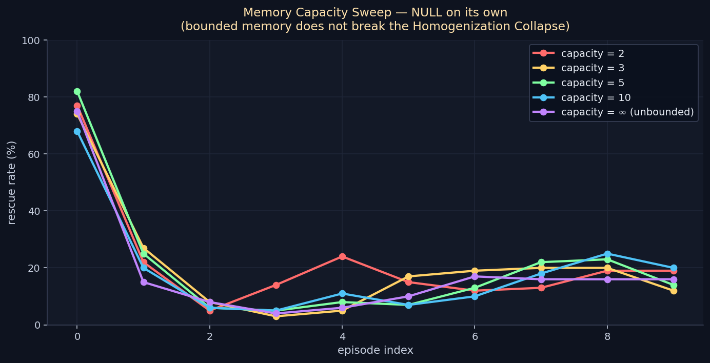

# Memory Capacity — NULL on its own

> **Result: NULL.** Bounding the memory store with least-impact eviction
> does NOT break the Homogenization Collapse on its own. Across capacities
> {2, 3, 5, 10, ∞}, divergence@5–9 stays in [-8, +8] pts and sustained
> rescue rate stays in [15%, 26%]. Memory size is not the bottleneck.
>
> **But:** this null is what motivates the next experiment
> (`personality_emergence_v1`), which finds the actual lever — encoding
> diversity — and yields a 2.55× sustained rescue rate.

**Date:** 2026-05-02 · **Episodes:** 5,000 (5 capacities × 100 agents × 10 chained eps) · **Runtime:** ~12 s

## The hypothesis

The Homogenization Collapse comes from cumulative memory taking over the
seeded prior. With unbounded storage, the agent's emotion bleed at recall
is dominated by an ever-larger pile of similar-context memories. Capping
the store with least-impact eviction should preserve the seeded prior's
structural role and produce stable behavioral types.

## What actually happened

| capacity | ep0 rescue | ep1 rescue | ep9 rescue | sustained avg ep5–9 | divergence@5–9 |
|---------:|-----------:|-----------:|-----------:|--------------------:|---------------:|
|        2 | 77% | 22% | 19% | ~17% | −2.5 pts |
|        3 | 74% | 27% | 12% | ~18% | +2.3 pts |
|        5 | 82% | 25% | 14% | ~14% | −8.3 pts |
|       10 | 68% | 20% | 20% | ~16% | +1.2 pts |
|     ∞    | 75% | 15% | 16% | ~18% | +7.5 pts |

No clean trend. Divergence is small and noisy in both signs. Sustained
rescue rate is uniformly low. Bounded memory does NOT produce behavioral
types.

## Mechanism (interpretation)

Eviction pulls down the LOWEST-impact memories, which means it preserves
the highest-impact ones. The highest-impact memories are exactly the
recent, in-context, high-emotion ones — the same ones that drive the
collapse mechanism. Bounding the store doesn't change the
emotion-feature distribution of what gets recalled; it just prevents
RAM growth.

The deeper issue: 100 agents with identical encoders converge to the
same memory-store profile regardless of how big the store is. The
problem is HOMOGENEITY, not SIZE. Bounded memory leaves homogeneity
untouched.

## Implication for the framework

This null forces the question: what's actually different between
agents in a chained-memory population? Up to this experiment: nothing,
except softmax-noise on action selection. The next experiment
(`personality_emergence_v1`) tests whether per-agent ENCODING diversity
— a structural source of agent-to-agent difference at the moment of
writing memories — is what's missing. (Spoiler: it is.)

## Files

| file | purpose |
|------|---------|
| `results.csv` | raw 5,000-row sweep |
| `memory_capacity_null.png` | rescue-rate trajectory by capacity |
