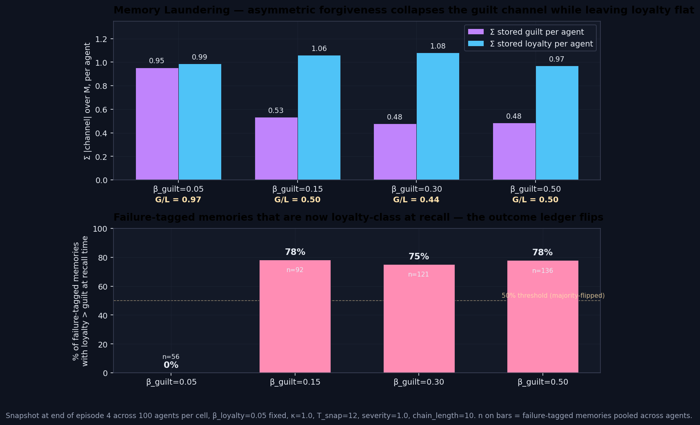

# Memory Population Audit — `memory_population_audit_v1`

> **Result: hypothesis CONFIRMED with a sharper mechanism.** Snapshotting the M store at end-of-ep4 across the four `decay_asymmetry_reversed` cells reveals that asymmetric forgiveness (β_guilt > β_loyalty) does not just shrink guilt-class memory weight — it **reclassifies failure-tagged memories as loyalty-class** at recall time. **78% of failure memories at β_guilt=0.15 have stored loyalty > stored guilt** (0% in the symmetric cell). The outcome ledger of the agent's M store collapses into a single emotional category. This is the mechanism behind the divergence-erosion observed in the 2026-05-05 and 2026-05-06 sweeps.

**Date:** 2026-05-07 · **Episodes:** 4,000 · **Runtime:** ~2s

## The hypothesis

Two prior sweeps showed divergence@5–9 collapse under asymmetric `mem_emotion_decay`. The 2026-05-05 sweep (β_guilt=0.05 fixed, sweep β_loyalty) inverted divergence from +13.3 to −18.8 pts. The 2026-05-06 sweep (β_loyalty=0.05 fixed, sweep β_guilt) eroded it from +10.6 to ~0 pts. The current backlog reading was: "any imbalance erases experience-driven type formation" — directionally agnostic.

The cleaner sub-hypothesis is that **per-class memory weight** carried that erosion. The γ·|emotion| factor of MemoryImpact is the only place where stored emotion magnitudes affect recall behavior; if asymmetric decay strips one channel faster, the M store's per-class recall pull goes lopsided. This run was the direct measurement: snapshot M at end-of-ep4 (the gateway into the divergence@5–9 window) and decompose it by class.

## What actually happened

Sweep: `β_guilt ∈ {0.05, 0.15, 0.30, 0.50}` with β_loyalty=0.05; κ=1.0, T_snap=12, severity=1.0, positive_encoding=True, rescue_importance=0.7, chain_length=10, n_agents=100. Total memory rows snapshotted at end-of-ep4: 3,400.

| β_guilt | Σ guilt /agent | Σ loyalty /agent | G/L | failures w/ loyalty>guilt |
|---:|---:|---:|---:|---:|
| 0.05 (symmetric) | **0.95** | 0.99 | 0.97 | **0% (0/56)** |
| 0.15 | 0.53 | 1.06 | 0.50 | **78% (72/92)** |
| 0.30 | 0.48 | 1.08 | 0.44 | **75% (91/121)** |
| 0.50 (extreme) | 0.48 | 0.97 | 0.50 | **78% (106/136)** |

Two findings stack. First, the per-agent stored-guilt total drops by ~50% as soon as β_guilt moves off symmetry — and then plateaus, not monotonic in β_guilt. The loyalty-channel total stays effectively constant across all four cells (0.97–1.08 per agent). The G/L ratio collapses from 0.97 (symmetric) to ~0.50 across all asymmetric cells.

Second — the sharper finding — at β_guilt ≥ 0.15 a clear **majority of failure-tagged memories now store more loyalty than guilt**. In the symmetric cell every single failure memory keeps the encoded ratio (guilt > loyalty); under asymmetric decay roughly three out of four failure memories have flipped, and during recall they are indistinguishable from rescue-class memories on the dimension that matters (which channel dominates |emotion|).

## Mechanism (interpretation)

Failure memories are encoded with `(guilt=0.85, loyalty=0.5)`. Once both channels decay over the ~60-step horizon between encoding and the end-of-ep4 snapshot, the stored values become roughly `0.85·(1−β_guilt)^age` and `0.5·(1−0.05)^age`. At symmetric β=0.05 the guilt channel keeps its 1.7× lead. At β_guilt=0.15 the guilt channel is multiplied by ~5×10⁻⁵ while loyalty hangs onto ~5%, so the residual is loyalty-dominant. The encoded outcome ledger has been **laundered**: the agent still holds memories of past failures, but those memories now look loyalty-flavored to the recall machinery.

This precisely closes the gap between the two prior findings. The 2026-05-05 sweep stripped loyalty fast, leaving rescue-class memories with no recall pull and failure-class memories dominant — divergence flips negative because ep1-rescuers are no longer pulled by their early-rescue memory. The 2026-05-06 sweep stripped guilt fast, laundering failure memories into loyalty class — divergence erodes because ep1-non-rescuers no longer have an emotionally-distinct memory of their early failure. Both directions destroy the per-class signature, just by different routes.

The flat plateau across β_guilt ∈ {0.15, 0.30, 0.50} is consistent: once decay is fast enough to outrun the ~60-step gap, the channel goes effectively to zero and further increases of β_guilt change nothing about the laundering rate. They only further degrade the seeded prior's grip on the agent during episode 0 — which is exactly what the regime-break in cell D was.

## Implication for the framework

The cushion-vs-counterweight reading and its successor "imbalance erases differentiation" reading are both replaced by a more concrete one:

> Asymmetric forgiveness operates as a **valence laundering** mechanism in M. Whichever channel decays faster gets erased from the population of stored memories on that side; failure memories no longer look like failures, or rescue memories no longer look like rescues. Recall cannot recover the per-outcome distinction the encoder put in.

This makes a clean, falsifiable prediction for several queued experiments:

- `decay_asymmetry_lower_kappa` — the laundering rate (% of failure memories with loyalty > guilt) should be ~0% in the symmetric cell and ~75% in the asymmetric cells regardless of κ. The macro divergence may not invert at κ=0.5 (where the boomerang is weaker), but the laundering microstructure should be identical.
- `recall_event_trace` — predicts that in laundered cells (β_guilt ≥ 0.15) the modal "guilt memory" reactivating during deliberation steps is the seeded prior (only one not produced by the agent), not any agent-encoded failure.
- `rescue_payload_magnitude` — orthogonal: should not change the laundering picture, because rescue memories aren't being laundered (their guilt channel is already 0 at encoding).

Follow-up questions queued:

- Does the laundering rate have an inflection? Sweep `β_guilt` finely between 0.05 and 0.15 to find where the failure memories start flipping.
- Re-run `decay_asymmetry` (the original direction) with this snapshot wired in to confirm the symmetric mirror — RESCUE memories should NOT launder (their guilt channel is 0 at encoding) but their |emotion| should drop as β_loyalty grows.
- Is the laundering reversible? If we re-strengthen stored emotion via a `recharge_on_recall` operator, does divergence come back?

## Files

| File | What it is |
|---|---|
| `README.md` | this scannable summary |
| `finding.md` | longer mechanism + falsifiability discussion |
| `results.csv` | per-episode rows (4,000 rows — for cross-checking outcomes against `decay_asymmetry_reversed_v1`) |
| `memory_snapshot.csv` | per-memory snapshots at end-of-ep4 and end-of-ep9 (6,800 rows) |
| `memory_population_audit.png` | two-panel chart: per-cell stored channel totals (top) and failure-memory laundering rate (bottom) |
