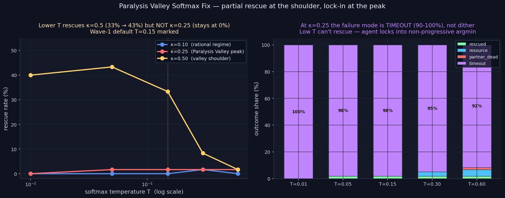

# Paralysis Valley — Softmax Temperature Probe (PARTIAL FIX, NEW MECHANISM)

> **Result: PARTIAL FIX + sub-mechanism revealed.** Lowering softmax
> temperature below the default 0.15 lifts rescue rate at κ=0.50 (the
> valley shoulder) from 33.3% to 43.3%. But at κ=0.25 (the deepest
> point in the valley), no temperature value rescues — agent
> times out 91–100% of the time. **The Paralysis Valley has TWO
> sub-mechanisms** — dither at the shoulder, lock-in at the peak —
> and they require different fixes.

**Date:** 2026-05-02 · **Episodes:** 900 (3 κ × 5 T × 60 agents × 1 ep) · **Runtime:** ~2 s

## The hypothesis

The Wave-1 Paralysis Valley was originally explained as "emotion is
loud enough to disrupt the value-action gradient but not loud enough
to commit." This frames the failure as DITHER between actions. If
true, lowering softmax temperature toward argmin should commit the
agent to whichever action has even a tiny lead — fixing the dither.

If this dither hypothesis holds across the valley, lower T should
rescue both the κ=0.5 shoulder AND the κ=0.25 peak.

## What actually happened

| κ \ T | T=0.01 | T=0.05 | T=0.15 (default) | T=0.30 | T=0.60 |
|------:|-------:|-------:|-----------------:|-------:|-------:|
| κ=0.10 (rational) | 0.0% | 0.0% | 0.0% | 1.7% | 0.0% |
| κ=0.25 (Paralysis Valley peak) | 0.0% | 1.7% | 1.7% | 1.7% | 1.7% |
| κ=0.50 (valley shoulder) | **40.0%** | **43.3%** | 33.3% | 8.3% | 1.7% |

At the shoulder (κ=0.50) the dither hypothesis holds: lowering T from
0.15 to 0.05 lifts rescue rate by 10 pts. Best at T=0.05.

**At the peak (κ=0.25) the dither hypothesis is REFUTED.** No T value
recovers the agent. Crucially, looking at the FAILURE BREAKDOWN at
κ=0.25 reveals the actual mechanism:

| T | rescued | resource_taken | timeout | partner_dead |
|---|--------:|---------------:|--------:|-------------:|
| 0.01 | 0.0% | 0.0% | **100.0%** | 0.0% |
| 0.05 | 1.7% | 0.0% | 98.3% | 0.0% |
| 0.15 | 1.7% | 0.0% | 98.3% | 0.0% |
| 0.30 | 1.7% | 3.3% | 95.0% | 0.0% |
| 0.60 | 1.7% | 5.0% | 91.7% | 1.7% |

At T=0.01 (essentially argmin), the agent times out **100% of the
time**. The agent isn't dithering between rescue, resource, and wait —
it's locking onto a non-progressive action and never breaking out. As
T grows, slightly more agents accidentally pick the resource action
(via softmax noise), but rescue rate barely budges.

## Mechanism (interpretation — refines the original Wave-1 story)

The Paralysis Valley is not a single failure mode. It has TWO
sub-mechanisms:

- **At κ=0.50 (the SHOULDER):** classic dither. The value gradient is
  strong enough that one action does have a slight lead in Φ; the
  default T=0.15 noises this lead into a near-tie at action selection
  time. Sharpening T toward argmin lets the slight lead win — partial
  rescue (33% → 43%).
- **At κ=0.25 (the PEAK):** *lock-in*. The seeded prior memory raises
  conflict cost on every action that is partner-aligned (loyalty
  conflict) AND value-aligned (the partner is far from the resource).
  At κ=0.25 the resulting Φ landscape has its minimum on a
  non-progressive action — likely "wait" — and the argmin commits to
  it deterministically. Sharpening T makes this WORSE, not better,
  because softmax noise was the only thing occasionally moving the
  agent off the locked action.

This means the temperature fix is regime-dependent and won't apply at
the deepest part of the valley. The κ=0.25 peak needs a different
intervention — likely something on the value or conflict side of Φ
rather than on the action-selection side.

## Implication for the framework

This sharpens the project's failure-mode catalog:

> **The Paralysis Valley is not a single failure mode. It has at least
> two sub-mechanisms: DITHER at the shoulder (κ ≈ 0.5, partially
> rescued by sharpening softmax temperature, 33% → 43%) and LOCK-IN at
> the peak (κ ≈ 0.25, not rescued by any temperature value). The peak
> failure is a 100% TIMEOUT — the agent commits to a non-progressive
> action and never breaks out.**

This is itself a new finding (the lock-in characterization is not in
the Wave-1 writeup). It tells the next experimenter where to look:
not in the action-selection layer, but in the Φ formulation itself —
specifically in how the seeded prior shapes the conflict landscape at
low κ.

Open follow-ups:

- Value-side perturbation: add per-action noise to v in Φ. Does this
  break the κ=0.25 lock-in?
- Inspect the actual Φ landscape at κ=0.25 — which action is the
  argmin, and is it actually "wait" or some specific direction?
- Try the κ=0.25 lock-in with mem_severity → 0 (no seeded prior).
  Does the lock-in disappear, confirming the seeded prior creates it?

## Files

| file | purpose |
|------|---------|
| `results.csv` | raw 900-row sweep |
| `paralysis_softmax_fix.png` | 2-panel chart |
