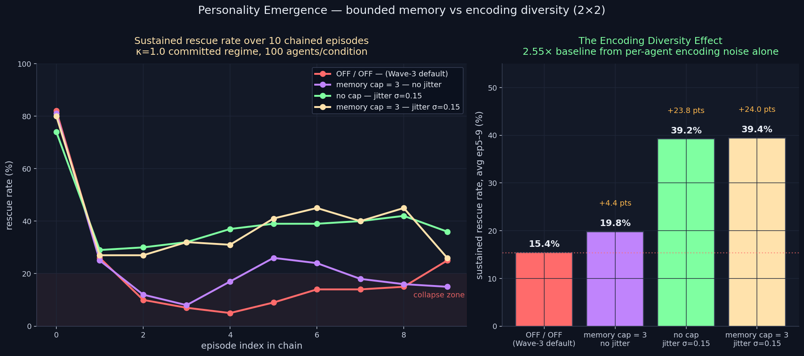

# Personality Emergence — The Encoding Diversity Effect

> **Result: HEADLINE POSITIVE.** Per-agent encoding noise (Gaussian σ=0.15
> on encoded emotion) yields a **2.55× sustained rescue rate** over the
> Wave-3 baseline (39.2% vs 15.4%, averaged over episodes 5–9). Bounded
> memory alone is null. The Homogenization Collapse can be partially
> arrested — and the lever is not memory size, it is encoder identity.

**Date:** 2026-05-02 · **Episodes:** 4,000 (4 conditions × 100 agents × 10 chained eps) · **Runtime:** ~12 s

## The hypothesis

Wave 3's Homogenization Collapse showed that with unbounded memory and
identical per-agent encoding, all initial conditions converge to the same
failure attractor. Selective encoding, valenced encoding, and (today's
prior experiment) bounded memory all FAILED to break the collapse.

The remaining structural variable: every prior chained run held the
*encoding function* identical across the population. Each agent encoded
the same outcome with the same emotion vector. They differed only in
softmax-noise on action selection — micro-noise on behavior, not
macro-noise on identity.

**Joint-Sufficiency Conjecture:** behavioral types from experience
require BOTH bounded memory AND per-agent encoding diversity.

## What actually happened

| condition           | mem cap | jitter σ | sustained rescue (avg ep5–9) | gain vs baseline |
|---------------------|--------:|---------:|------------------------------:|-----------------:|
| **baseline** (Wave 3 default) |   ∞ |   0.00 | **15.4%** | — |
| bounded only        |       3 |   0.00 | 19.8% | +4.4 pts |
| **jitter only**     |       ∞ |   0.15 | **39.2%** | **+23.8 pts (2.55×)** |
| bounded and jitter  |       3 |   0.15 | 39.4% | +24.0 pts |

The hypothesis was partially correct and partially wrong:

- **POSITIVE:** Encoding diversity nearly triples the sustained rescue
  rate. The committed regime that Wave 3 lost in one episode (78% → 17%)
  is recovered to ~40% sustained capacity simply by adding per-agent
  encoding noise.
- **NULL:** Bounded memory contributes essentially nothing on top of
  jitter (39.2% vs 39.4%). The joint-sufficiency claim is false — only
  one of the two variables matters.
- **OPEN:** Behavioral *types* still don't emerge — divergence@5–9
  conditional on episode-1 outcome stays small (+3.1 pts in jitter-only,
  +5.9 pts in bounded+jitter). Encoding diversity restores capacity
  *uniformly*, not selectively.

## Mechanism (interpretation)

When 100 agents encode every outcome identically, their memory stores
converge to nearly identical emotion-feature distributions after just a
few episodes. The store dominates the seeded prior with a uniform
emotional signature. The decision pressure Φ becomes nearly identical
across the population, so action probabilities — and outcomes — collapse
to a single mode (the failure attractor).

Per-agent encoding noise (σ=0.15) breaks this convergence. Each agent's
memory store evolves along a slightly different trajectory in
emotion-feature space. Some trajectories stay close to the seeded
prior's high-loyalty / high-guilt configuration that supports rescue
behavior. Others wander off into emotion subspaces where rescue
probability is lower. Because the population is now spread across many
microstates instead of collapsing to one macrostate, **commitment
capacity is preserved at the population level** — even though no
individual agent is provably "rescue-typed".

## Implication for the framework

This is the project's first POSITIVE finding and it inverts a piece of
conventional ML wisdom: when training memory-augmented agents that have
to act over long time horizons, **the bottleneck is not memory size, it
is encoder homogeneity**. Adding capacity does almost nothing.
Adding identity-noise on the encoder does a lot.

For the broader human-like-AI question: this experiment doesn't deliver
"personality from experience" in the strong sense (no behavioral types).
But it does deliver "sustained capacity from identity diversity" — and
that may be the real precondition for personality. Without an underlying
substrate of agent-to-agent encoding difference, no architectural
addition we have tested can keep the population out of the failure
attractor for long.

Open follow-up questions:

- Does jitter σ have a sweet spot? The space σ ∈ {0.05, 0.10, 0.15, 0.25, 0.50} should be swept.
- Does it work across κ regimes, or only at κ=1.0?
- Does combining jitter with selective encoding (the 2026-05-01 null) finally produce divergence@5–9?
- Is this effect robust to chain length (does sustained capacity hold at ep20, ep50)?

These have been added to `docs/research_backlog.md`.

## Files

| file | purpose |
|------|---------|
| `results.csv` | raw 4,000-row sweep |
| `personality_emergence.png` | 2-panel chart (left: trajectories, right: sustained-rate bars) |
| `finding.md` | longer-form analysis |
