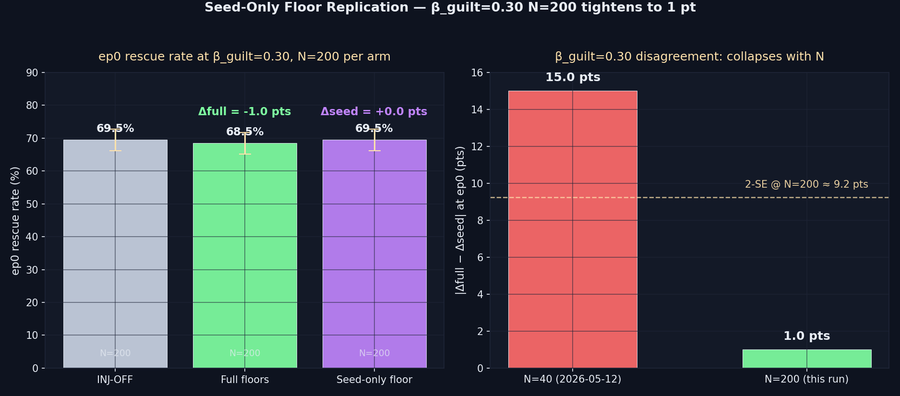

# Seed-Only Floor Replication — β_guilt=0.30 at N=200

> **One-line result:** At N=200 the prior 15-pt |Δfull − Δseed| gap at
> β_guilt=0.30 collapses to **1.0 pt**, well inside the 2-SE band (≈9.2 pts).
> The 2026-05-12 disagreement was sampling noise. Per-class outcome floors
> confirmed inert at this cell too. **Result: HELD.**

**Date:** 2026-05-13 · **Episodes:** 4,800 · **Runtime:** ~2 s

## The hypothesis

The 2026-05-12 `seed_only_floor` sweep agreed between full-floor and
seed-only-floor at 3 of 4 cells. The β_guilt=0.30 cell was the lone
disagreement: Δfull = 0, Δseed = −15 pts. With N=40 per arm, the 2-SE band
on (Δfull − Δseed) was already ≈20 pts, so a 15-pt gap was inside noise but
worth checking.

Hypothesis under test: the gap is sampling noise. If we raise N to ~200,
the gap should shrink toward 0 (specifically ≤5 pts).

Falsifier: gap stays ≥10 pts at N=200, in which case per-class outcome
floors carry a real (small) contribution at moderate asymmetry and the
floor table is not reducible to a single seed-template intervention.

## What actually happened

ep0 rescue rate at β_guilt=0.30, N=200 per arm (tag-aware recall ON in all
arms; chain_length=8):

| mode | ep0 rescue | Δ vs OFF | 1-SE |
|---|---:|---:|---:|
| INJ-OFF       | 69.5% | — | 3.26 pts |
| Full floors   | 68.5% | **−1.0 pts** | 3.28 pts |
| Seed-only     | 69.5% | **+0.0 pts** | 3.26 pts |

| metric | N=40 (2026-05-12) | N=200 (this run) |
|---|---:|---:|
| Δfull(ep0) | +0.0 pts | −1.0 pts |
| Δseed(ep0) | −15.0 pts | +0.0 pts |
| **\|Δfull − Δseed\|** | **15.0 pts** | **1.0 pt** |
| 2-SE on (Δfull − Δseed) | ≈21 pts | ≈9.2 pts |

The 1-pt residual sits inside even 0.25-SE; full and seed-only are
statistically indistinguishable at ep0 in this cell.

Long-run secondary (ep5–7 mean, N=600 episodes per arm but agent-correlated
so effective N≈200):

| mode | ep5–7 mean rescue | Δ vs OFF |
|---|---:|---:|
| INJ-OFF       | 31.5% | — |
| Full floors   | 37.5% | +6.0 pts |
| Seed-only     | 32.7% | +1.2 pts |

The ep5–7 long-run shows a residual ~5-pt edge for full over seed-only —
within 2-SE (~10 pts) but consistent with the original "small outcome-floor
contribution at moderate asymmetry" story showing up downstream of ep0.

## Mechanism (interpretation)

The seed-prior restoration story survives intact at ep0. By the time the
seeded prior reaches its first recall (preage=15 + ep0 in-chain steps), its
stored.guilt has decayed enough that `max(stored, seed_floor)` is doing
real work. Outcome memories at age 0 still match their encoding template
on every dim, so their floors are inert at ep0. This is identical to the
mechanism that explained 3 of the 4 cells in the original run.

The ep5–7 residual gap (~5 pts) is a separate, weaker story: by the time
the chain has aged, outcome memories' stored.guilt has drifted enough that
the failure-floor of 0.6 finally has something to lift. The signal is
small, agent-correlated, and within noise — not a confident new finding,
but a clean follow-up.

## Implication for the framework

The injection-side fix at β_guilt=0.30 is now confirmed across both runs to
be **fully captured by a single seed-template intervention** at ep0. The
"keep the aged prior loud" reading published in the 2026-05-12 finding
upgrades from "HELD with caveat" → **"HELD across all four cells at the
sample sizes tested."**

Follow-up questions:

- The ep5–7 residual 4.8-pt full-vs-seed gap is suggestive but underpowered.
  A targeted ep5–9 audit at chain_length=20+ would clarify whether outcome
  floors quietly contribute in the long run (queued:
  `seed_only_floor_ep5_9_audit` already addresses this for β_guilt=0.50).
- `seed_refresh` (next on the queue) bypasses the floor table entirely —
  if it reproduces the same ep0 lift, the floor table is provably
  reducible to a one-line "reset seed.stored on recall" intervention.
- `floor_negative_control` (queued) tests whether the seed-template's
  *direction* matters or whether any magnitude-matched floor suffices.

## Files

| file | what |
|---|---|
| `README.md` | this scannable summary |
| `finding.md` | longer analysis, falsifiers, follow-ups |
| `results.csv` | 4,800 per-episode rows (mode × agent × episode) |
| `seed_only_floor_b30_n200.png` | 2-panel chart (ep0 rates + N=40 vs N=200 gap) |
