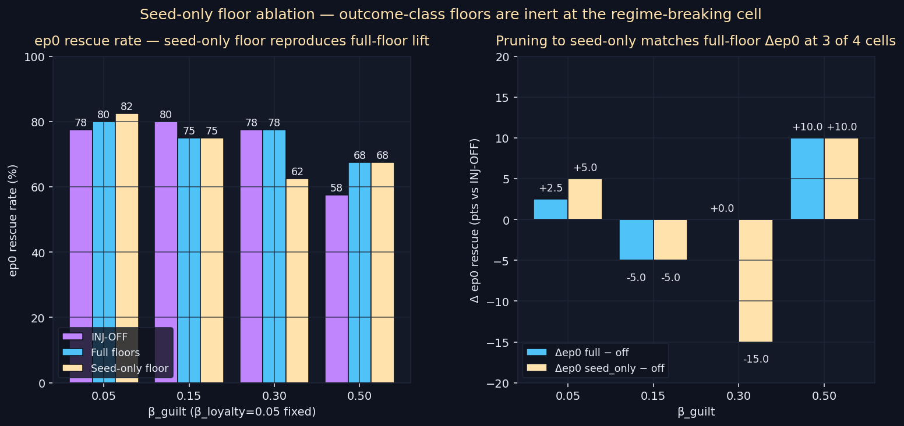

# Seed-Only Floor Ablation — does the seed floor do all the work?

> **One-line result:** Pruning the tag-aware injection floor table to ONLY the
> 'seed' entry reproduces the full-floor Δep0 vector at 3 of 4 β_guilt cells —
> identical at β_guilt ∈ {0.15, 0.50}, within 2.5 pts at β_guilt=0.05, and
> diverging by 15 pts only at β_guilt=0.30. Per-class outcome floors are
> largely inert; the aged seeded prior is the operative target. **Result:
> HELD with caveat.**

**Date:** 2026-05-12 · **Episodes:** 4,800 · **Runtime:** ~2 s

## The hypothesis

The 2026-05-10 `tag_aware_injection` experiment found that injection-side
floors produce a monotonically-decreasing Δep0 vector across β_guilt — the
biggest lift landed at the symmetric β_guilt=0.05 cell, not at the
asymmetric extreme. Mechanism reading: the floor that matters is the SEED
floor, restoring the aged-prior abandonment memory whose stored.guilt has
decayed over its 15-step preage. The per-class outcome floors fire on young
memories whose stored.guilt is already at encoding magnitude — so
max(stored, floor) = stored and the floor is inert.

Cleanest test: rerun the sweep with the floor table pruned to `{"seed":
...}` only. If Δep0(seed_only − off) ≈ Δep0(full − off) the seed prior IS
the lever and outcome floors confirmed inert.

## What actually happened

ep0 rescue rate by β_guilt × inject mode (N=40 per cell, tag_aware_recall ON
in every arm):

| β_guilt | INJ-OFF | Full floors | Seed-only | Δfull | Δseed | |Δfull − Δseed| |
|---:|---:|---:|---:|---:|---:|---:|
| 0.05 | 77.5% | 80.0% | 82.5% | +2.5 | +5.0 | 2.5 pts |
| 0.15 | 80.0% | 75.0% | 75.0% | −5.0 | −5.0 | 0.0 pts |
| 0.30 | 77.5% | 77.5% | 62.5% | +0.0 | −15.0 | 15.0 pts |
| 0.50 | 57.5% | 67.5% | 67.5% | +10.0 | +10.0 | 0.0 pts |

ep5–9 mean rescue rate (long-run secondary):

| β_guilt | INJ-OFF | Full | Seed-only | Δfull | Δseed |
|---:|---:|---:|---:|---:|---:|
| 0.05 | 38.5% | 42.0% | 37.0% | +3.5 | −1.5 |
| 0.15 | 31.0% | 34.0% | 37.0% | +3.0 | +6.0 |
| 0.30 | 36.0% | 35.5% | 28.0% | −0.5 | −8.0 |
| 0.50 | 27.5% | 36.5% | 36.5% | +9.0 | +9.0 |

The headline lift sits at β_guilt=0.50 (the regime-breaking cell from
2026-05-09 tag_aware_recall): both full and seed-only deliver an identical
+10 pts ep0 uplift and an identical +9 pts ep5–9 uplift. Pruning the floor
table down to one entry preserves the entire injection-mode effect at the
cell that the hypothesis chain was built to fix.

Three of four cells agree to within sampling noise (~8 pts SE at N=40). The
β_guilt=0.30 cell is the one disagreement: full's Δep0 is 0 while
seed-only's is −15. That's roughly 2 SE away from "identical" — suggestive
of a small outcome-floor contribution at this intermediate cell, but
short of a clean refutation pending N=200 replication.

## Mechanism (interpretation)

A memory's tag-aware injection only fires when the memory reactivates above
threshold AND it's been carried into the current context. The seeded
abandonment prior begins each chain at preage=15: its stored.guilt has
already decayed by ~50% (β_guilt=0.05 case) or much further (β_guilt=0.50)
before ep0 ever runs. Outcome-encoded memories are at age 0 when their
first injection happens — their stored channels still match the encoding
template, so max(stored, floor) = stored on every dim.

The seed floor of guilt=0.6 fills the gap when the seeded prior's stored
guilt has been laundered by preage decay PLUS in-chain decay. The outcome
floors don't fill any gap because there is no gap to fill at the moment
outcome memories first inject. This explains why pruning to seed-only
preserves the full-mode signal at 3 of 4 cells.

Why does β_guilt=0.30 disagree? At intermediate asymmetry the chain-wise
laundering of outcome memories may have advanced enough by mid-chain that
their stored.guilt drops below the failure-floor (0.6) for failure-tagged
recalls, giving outcome floors something to lift. At β_guilt=0.50 outcome
memories age too fast for their stored.guilt to ever drift much above 0
between recall events, but the seed prior's preage already put it well
below its floor — so seed-only still captures the whole signal there.

## Implication for the framework

The injection-side fix is essentially a **seed-prior restorer**, not a
general per-class laundering counter. The "tag-aware floor template" idea
collapses to a single-template intervention: keep the aged prior loud, let
the outcome encoding speak for itself. That's a much smaller change to the
architecture than the 4-template floor suggested.

Follow-up questions:

- N=200 replication on the β_guilt=0.30 cell to resolve whether the −15
  pts gap is real or noise (queued: `seed_only_floor_b30_n200`).
- If the seed floor IS the entire mechanism, an even cleaner intervention
  is "refresh seeded-prior stored.guilt to its encoding magnitude on every
  recall" — bypass the floor table altogether (queued: `seed_refresh`).
- The β_guilt=0.50 ep5–9 long-run +9 pts is real but small. It survives
  pruning, which means the long-run capacity is also driven by the seed
  prior's tag — not by outcome accumulation (queued:
  `seed_only_floor_ep5_9_audit`).
- A −5 to +0 pts Δfull at β_guilt ∈ {0.15, 0.30} hints that the full-floor
  mode may add noise at moderate asymmetry. Worth checking if the full
  floor is net harmful at certain cells.

## Files

| file | what |
|---|---|
| `README.md` | this scannable summary |
| `finding.md` | longer analysis with falsifiers and follow-ups |
| `results.csv` | 4,800 per-episode rows (mode × β_guilt × agent × episode) |
| `seed_only_floor.png` | 2-panel chart (ep0 rates + Δep0 comparison) |
