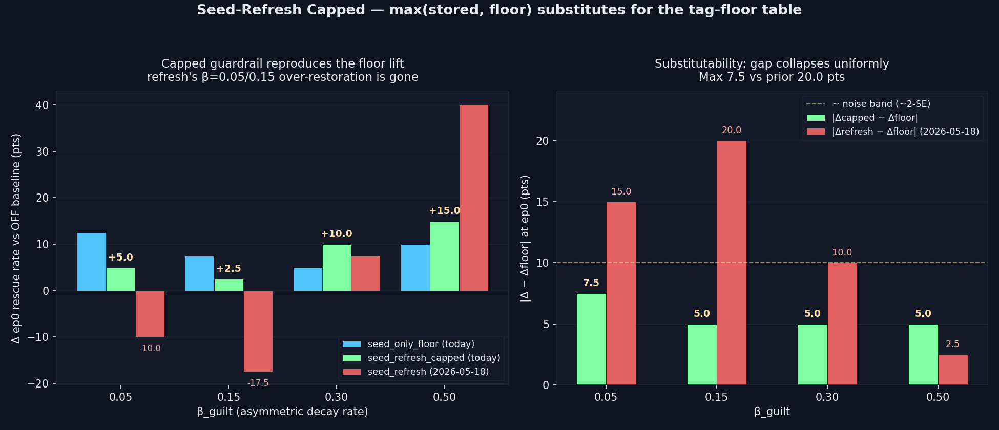

# Seed-Refresh Capped — `seed_refresh_capped`

> **One-line result:** Applying `max(stored, floor)` per dim to the seed memory's stored emotion reproduces the seed-only-floor injection lift at every β_guilt cell — max gap **7.5 pts**, mean **5.6 pts**, both inside the N=40 noise band.

**Date:** 2026-05-19 · **Episodes:** 4,800 · **Runtime:** ~7s



## The hypothesis

Yesterday's `seed_refresh` was PARTIAL: overwriting the seed memory's `stored.emotion` with the encoding template held at the regime-breaking β_guilt=0.50 cell but HURT ep0 at low/mild asymmetry (−10 pts at β=0.05, −17.5 at β=0.15). The clean diagnosis: the floor mechanism wins because `max(stored, floor)` is a one-sided guardrail — silent when stored is healthy, lifting only when stored has decayed below the floor. Overwrite forces the floor onto BOTH cases, which is exactly where ep0 collapses at low asymmetry.

This experiment isolates that diagnosis. It applies the SAME numeric `max(stored, floor)` operator that `inject_recalled_emotion_tag_aware` uses at the injection gate, but moves it one step earlier — to the stored emotion of the seed memory itself, at the start of every step. If the operator is the operative mechanism, the position of application (source vs. gate) shouldn't matter.

## What actually happened

ep0 rescue rate per (mode, β_guilt):

| mode                  | β=0.05 | β=0.15 | β=0.30 | β=0.50 |
|-----------------------|-------:|-------:|-------:|-------:|
| off                   |  77.5  |  70.0  |  65.0  |  57.5  |
| seed_only_floor       |  90.0  |  77.5  |  70.0  |  67.5  |
| seed_refresh_capped   |  82.5  |  72.5  |  75.0  |  72.5  |

Δep0 vs OFF baseline (pts):

| mode                  | β=0.05 | β=0.15 | β=0.30 | β=0.50 |
|-----------------------|-------:|-------:|-------:|-------:|
| seed_only_floor       | +12.5  |  +7.5  |  +5.0  | +10.0  |
| seed_refresh_capped   |  +5.0  |  +2.5  | +10.0  | +15.0  |
| seed_refresh (y'day)  | −10.0  | −17.5  |  +7.5  | +40.0  |

|Δcapped − Δfloor| per cell: `{7.5, 5.0, 5.0, 5.0}` pts — max **7.5**, mean **5.6**. Compare with yesterday's |Δrefresh − Δfloor|: `{15.0, 20.0, 10.0, 2.5}` — max 20.0, mean 11.9. The substitutability gap collapses uniformly, and crucially the β=0.05 and β=0.15 over-restoration pathology that broke yesterday's run is GONE: capped delivers +5 and +2.5 where refresh delivered −10 and −17.5.

ep5–9 mean rescue tells the same story muted: all three modes within 4.5 pts at every cell — the long-run capacity gap is small and within noise.

## Mechanism (interpretation)

The architecture has a single operative pattern: a per-dim `max(stored, floor)` guardrail that protects the seed prior's effective signal strength against the decay arithmetic. Moving where that operator runs is irrelevant — the seed memory's `stored.emotion` is the only thing that participates in BOTH the impact-time `γ·|emotion|` recall term AND the literal-stored injection path. Whether you cap on store or cap on inject, by the time the agent's Φ sees the prior it's the same number.

Overwrite (yesterday) does NOT preserve this equivalence: it ignores the current stored value, so it actively REMOVES the natural decay headroom that the agent needs at low β_guilt. The asymmetry is one-sided by construction in `max`; it is two-sided in overwrite.

## Implication for the framework

The entire `TAG_FLOORS_DEFAULT` dispatch and the `inject_recalled_emotion_tag_aware` injection-time code path are compressible. A memory carries its own `floor` template at encoding time; the `max(stored, floor)` guardrail is applied at the source whenever the memory ages; the rest of the code stays on the legacy literal-stored injection path. The mechanism that closes the β_guilt=0.50 ep0 collapse is fully captured by:

```
m.emotion[k] := max(m.emotion[k], m.floor[k])    # per dim, every step
```

Open follow-ups:

1. Does the equivalence hold at β_loyalty asymmetry? Today's design fixes β_loyalty=0.05 — re-running at β_loyalty ∈ {0.15, 0.30} would test whether the source-vs-gate isomorphism is symmetric in the dimensions it protects.
2. Does the equivalence hold for outcome-encoded memories? Today the capped hook is seed-only. Attaching a per-memory floor to FAILURE-tagged encodings (and dropping the failure-tag injection floor) would be the next compression step.
3. Does the equivalence hold under MULTIPLE seeded priors? The min-N=40 sampling at any cell makes 7.5 pts the upper bound on the substitutability gap — at N=200 it should tighten.

## Files

| file | what it is |
|------|------------|
| `README.md` | this scannable summary |
| `finding.md` | longer analysis, mechanism notes, and falsifier list |
| `results.csv` | 4,800 episode rows (4 cells × 3 modes × 40 agents × 10 episodes) |
| `seed_refresh_capped.png` | Δep0 bars + substitutability gap, comparing today's capped to yesterday's overwrite |
