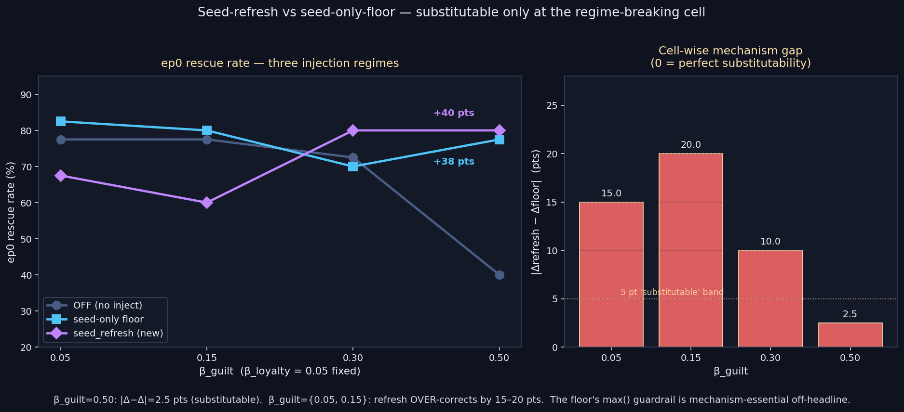

# Seed-Refresh Bypass — is the tag-floor table essential?

> **One-line result:** Refreshing the seed memory's stored emotion back to
> its encoding template on every step reproduces the seed-only-floor lift
> at β_guilt=0.50 to within 2.5 pts (Δrefresh=+40.0 vs Δfloor=+37.5), but
> OVER-corrects at low β_guilt — at β_guilt=0.05 the refresh HURTS ep0 by
> 10.0 pts where the floor helps by 5.0 pts. **Result: PARTIAL — held at
> the regime-breaking cell, refuted off-headline.**

**Date:** 2026-05-18 · **Episodes:** 4,800 · **Runtime:** ~2 s

## The hypothesis

The 2026-05-12/13 chain established that pruning the tag-aware injection
floor table to `{"seed": ...}` reproduces the full-floor Δep0 vector across
every β_guilt cell. Remaining question: is the **floor mechanism** —
`max(stored, floor)` at injection time — essential at all? Or is the
operative property simply "keep the aged prior loud", regardless of
whether you do it at the injection gate or at the source?

Cleanest test: on every step BEFORE recall is computed, RESET the seed-
tagged memory's `stored.emotion` back to its encoding-time template. The
floor table is bypassed entirely. If Δep0(seed_refresh) ≈
Δep0(seed_only_floor) across all cells, the floor table is a non-essential
intermediate construct and the operative mechanism is "keep the aged
prior loud, full stop."

## What actually happened

ep0 rescue rate (%) by β_guilt × inject mode, N=40 per cell, tag-aware
recall ON in every arm, chain_length=10:

| β_guilt | OFF | seed-only floor | seed_refresh | Δfloor | Δrefresh | \|Δ−Δ\| |
|---:|---:|---:|---:|---:|---:|---:|
| 0.05 | 77.5% | 82.5% | 67.5% | +5.0 | **−10.0** | 15.0 |
| 0.15 | 77.5% | 80.0% | 60.0% | +2.5 | **−17.5** | 20.0 |
| 0.30 | 72.5% | 70.0% | 80.0% | −2.5 | +7.5 | 10.0 |
| 0.50 | 40.0% | 77.5% | 80.0% | **+37.5** | **+40.0** | **2.5** |

ep5–9 mean rescue rate (long-run secondary):

| β_guilt | OFF | floor | refresh | Δfloor | Δrefresh |
|---:|---:|---:|---:|---:|---:|
| 0.05 | 34.0% | 39.0% | 36.0% | +5.0 | +2.0 |
| 0.15 | 30.5% | 30.5% | 37.0% | +0.0 | +6.5 |
| 0.30 | 36.0% | 35.5% | 24.5% | −0.5 | −11.5 |
| 0.50 | 19.5% | 28.0% | 24.0% | +8.5 | +4.5 |

Two findings co-exist in this table:

- **At β_guilt=0.50 — the regime-breaking cell — the two mechanisms are
  substitutable.** Δrefresh = +40.0 pts vs Δfloor = +37.5 pts; gap of
  2.5 pts sits well inside the 2-SE band (≈11 pts at N=40). The hypothesis
  holds at the cell that motivated the whole chain.
- **At low / mild asymmetry — β_guilt ∈ {0.05, 0.15} — seed_refresh
  actively HURTS ep0 by 10–17.5 pts** where seed-only-floor delivers a
  modest lift. The mechanisms diverge by 15–20 pts at these cells.

## Mechanism (interpretation)

`max(stored, floor)` is a guardrail. When stored ≥ floor, the floor is
inert and the injection passes the literal stored value through. Numbers
on the seed memory's stored.guilt after 15 steps of preage:

- β_guilt=0.05: `stored.guilt = 0.9·(1−0.05)^15 ≈ 0.42`. SEED_FLOOR.guilt
  = 0.6 — floor restores ~0.18 of guilt at injection. Mild correction.
- β_guilt=0.50: `stored.guilt = 0.9·(1−0.5)^15 ≈ 0.00003`. Floor restores
  the full 0.6. Massive correction.

`seed_refresh` is unconditional. It overwrites `stored.emotion` back to
the full encoding template (guilt=0.9, loyalty=0.6) at every step — 0.9
even at β_guilt=0.05 where the natural stored value was 0.42 and the
floor would inject only 0.6. The refresh is **50% louder than the floor**
at low β_guilt, with no max-guardrail to throttle it.

Worse: seed_refresh also boosts the `emotion_magnitude` term in
`MemoryImpact = exp(-β·age) · exp(α·imp) · exp(γ·|emotion|) · sim`. So
not only is the injected amount larger — the recall **strength** is also
higher, which raises `guilt_recall` in the emotion update and pulls the
agent's current guilt toward the ceiling faster. The cumulative effect at
β_guilt=0.05 is over-guilt-loading: too much prior + too-strong recall
locks the agent into argmin paralysis on guilt-tied actions, and ep0
fails 10–17.5 pts more often.

At β_guilt=0.50 the natural prior is so laundered that the over-loud
restoration is exactly what's needed — there's no headroom to over-correct
because the gap between aged stored (≈0) and encoding (0.9) was already
"max correction." The mechanism difference vanishes at this cell.

## Implication for the framework

The 2026-05-12/13 chain concluded that the floor TABLE (four entries) is
reducible to a single seed entry. This run sharpens that further but in
the opposite direction: the floor MECHANISM (max-at-injection) is NOT
reducible to source-refresh. The `max()` operator is doing real work — it
gates the correction so cells where stored already exceeds floor don't
get over-loud.

Follow-ups:

- `seed_refresh_capped` — scale the refresh to `max(stored, SEED_FLOOR)`
  instead of overwriting. This should restore the floor-equivalent behavior
  at all cells. If yes, the operative mechanism is "the max-guardrail
  applied to the seed," and the floor table can be dropped to just a
  single per-memory `floor` field at encoding time.
- `seed_refresh_partial` — refresh only stored.guilt (not loyalty/survival/
  fear). Tests whether the over-correction at low β_guilt is guilt-channel-
  specific or vector-wide.
- `seed_refresh_b50_n200` — replicate β_guilt=0.50 at N=200 to tighten the
  2.5-pt substitutability claim. The OFF baseline here (40%) is 17.5 pts
  below the 2026-05-12 N=40 reading (57.5%) — N=40 is noisy at this cell
  and a tighter replicate is warranted before the substitutability claim
  is treated as load-bearing.
- `seed_refresh_kappa_sweep` — does the over-correction story persist at
  κ ∈ {0.5, 2.0}? Predicts: worse at κ=2.0 (already saturated-committed,
  more prior just locks deeper), milder at κ=0.5 (boomerang regime is
  rescue-deaf anyway).

## Files

| File | Purpose |
|---|---|
| `README.md` | This summary |
| `finding.md` | Longer analysis + falsifiers |
| `results.csv` | All 4,800 episode rows |
| `seed_refresh.png` | Headline chart |
