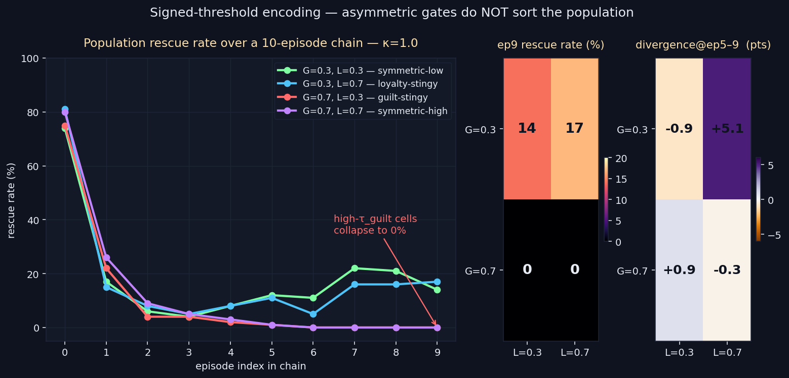

# Signed-Threshold Encoding — The Prior-Dilution Lockout

> **Result: hypothesis FAILED in opposite direction.** Asymmetric encoding
> gates do NOT sort the population. The cells the hypothesis predicted would
> be best (high τ_guilt) collapse to **0% rescue rate by ep9** — a NEW
> failure mode driven by prior-dilution starvation.

**Date:** 2026-05-03 · **Episodes:** 4,000 · **Runtime:** ~5 s

## The hypothesis

Both prior selectivity experiments treated the rescue and failure encoding
channels as symmetric. But the seeded abandonment prior is asymmetric (high
guilt, moderate loyalty), so SIGNED gates — different τ for guilt-charged
vs loyalty-charged outcomes — should be able to sort the memory store and
preserve behavioral types. Specifically, low τ_loyalty + high τ_guilt was
predicted to liberally log rescues while starving the guilt channel,
yielding a rescue-stable population.

## What actually happened

| cell                       | encoding rate | ep0 rescue | ep9 rescue | divergence@ep5–9 |
|----------------------------|--------------:|-----------:|-----------:|-----------------:|
| **G=0.3, L=0.3** symmetric-low  | 98.9% | 74% | 14% | −0.9 pts |
| **G=0.3, L=0.7** loyalty-stingy | 96.6% | 81% | **17%** | **+5.1 pts** |
| **G=0.7, L=0.3** guilt-stingy   | 24.8% | 75% | **0%**  | +0.9 pts |
| **G=0.7, L=0.7** symmetric-high | 23.8% | 80% | **0%**  | −0.3 pts |

The two predictions both fail:

1. The hypothesis's "best-bet" cell (G=0.7, L=0.3 — easy rescue logging,
   hard failure logging) collapses to **0% rescue rate by episode 9**, the
   worst observed. The seeded abandonment prior dominates in perpetuity
   because lived failure experience is filtered out before it can dilute
   the prior.
2. The cell with the highest divergence (+5.1 pts at G=0.3, L=0.7) is the
   *opposite* configuration — easy failure logging, harder rescue logging.
   Even there, divergence is INFERIOR to the +11.5 pts achieved by simple
   symmetric τ=0.3 in `selective_encoding_v1`.

## Mechanism (interpretation)

The encoding rate per outcome class explains both surprises. The terminal
emotion of `RESOURCE_TAKEN` episodes has very low magnitude (e_max ≈ 0.10):
the agent quietly grabs the resource and finishes calmly. So a τ_guilt of
0.7 *eliminates* RESOURCE_TAKEN encodings entirely (0/308 at G=0.7, L=0.3)
and silences ~76% of TIMEOUTs. With failure events blocked from the store,
the seeded abandonment prior is never diluted by lived experience — its
guilt-recall stays elevated forever, so the agent keeps switching targets
and the partner deadline expires every chain. **High guilt threshold
manufactures permanent paralysis** rather than committed rescue.

By contrast, `PARTNER_RESCUED` saturates emotion (e_max ≈ 0.88) by design,
so even τ_loyalty=0.7 only filters out ~13% of rescues — a mild perturbation,
not a sort.

## Implication for the framework

Asymmetric thresholds compound rather than escape the Homogenization
Collapse. The signed-gate intuition (let the rescuer's joy reach the store
unobstructed; raise the bar for failure) backfires because it rests on a
false premise — that rescue and failure events have comparable emotional
intensity. They don't. Failure is mostly quiet (`RESOURCE_TAKEN` looks
emotionally neutral), so any guilt-side threshold above the noise floor
preserves the seeded prior intact.

Open follow-ups:

- `prior_dilution_rate` (already queued) — vary the seeded preage; predict
  the high-G collapse vanishes when the prior starts weaker.
- Threshold by *outcome valence directly* (boolean gate per outcome type)
  rather than by terminal emotion magnitude — the variable mismatch was
  the real flaw here.
- Per-outcome importance scaling (rescue at 0.85, failure at 0.5) instead
  of per-outcome thresholding — change *weight*, not *whether*, of the
  encoding.

## Files

| file | purpose |
|------|---------|
| `results.csv` | raw 4,000-row sweep (4 cells × 100 agents × 10 episodes) |
| `signed_threshold_encoding.png` | trajectory + 2×2 heatmap chart above |
| `finding.md` | longer written analysis |
