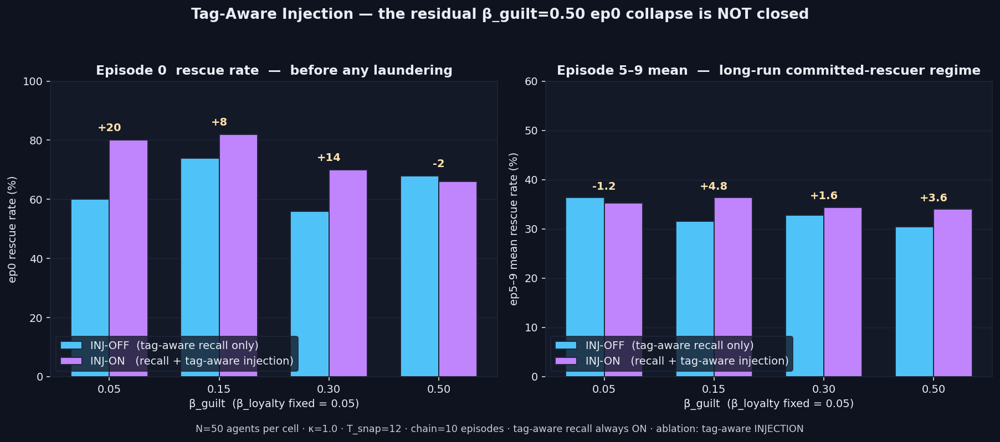

# Tag-Aware Injection — The Residual Is Not Laundering

> **Result: hypothesis FAILED at the specific cell it targeted.** Tag-keyed
> floors on the injection pathway do NOT close the residual β_guilt=0.50 ep0
> collapse left over by the 2026-05-09 tag-aware-recall fix. Δep0 at
> β_guilt=0.50 = **−2.0 pts** (66% INJ-ON vs 68% INJ-OFF, within sampling
> noise). The injection pathway is not the second mechanism.

**Date:** 2026-05-11 · **Episodes:** 4,000 · **Runtime:** ~30 s

## The hypothesis

`tag_aware_recall` (2026-05-09) restored the guilt-recall *gate* — feeding
the `GUILT_RATE × guilt_recall` term in `step_emotion`. It approximately
doubled ep5–9 mean rescue at every β_guilt cell but left a residual at
β_guilt=0.50: ep0 rescue stayed at 58% (vs ~78% symmetric baseline). The
backlog conjecture was that `inject_recalled_emotion` still uses the
*literal* decayed stored channels — so even when the recall gate correctly
classifies a laundered failure memory as guilt-class, the injection adds ≈0
guilt to current e_t. The fix tested here: route injection through a
tag-keyed floor (`max(stored_dim, floor_dim)`) so guilt-tagged memories
always contribute a guilt floor regardless of decay.

## What actually happened

| β_guilt | INJ-OFF ep0 | INJ-ON ep0 | **Δep0** | INJ-OFF ep5-9 | INJ-ON ep5-9 | Δep5-9 |
|--------:|------------:|-----------:|---------:|--------------:|-------------:|-------:|
| 0.05    | 60.0%       | 80.0%      | **+20.0** | 36.4%        | 35.2%        | −1.2   |
| 0.15    | 74.0%       | 82.0%      | +8.0     | 31.6%         | 36.4%        | +4.8   |
| 0.30    | 56.0%       | 70.0%      | +14.0    | 32.8%         | 34.4%        | +1.6   |
| **0.50**| **68.0%**   | **66.0%**  | **−2.0** | 30.4%         | 34.0%        | +3.6   |

Three observations:

- At the headline cell (β_guilt=0.50, the residual-collapse cell the
  hypothesis targeted), ep0 rescue is **flat** — Δ = −2.0 pts, well inside
  the ~10-pt 2-sample sampling SE at N=50. The injection floor does **not**
  close the residual gap.
- The biggest ep0 uplift (+20 pts) lands at the **symmetric** β_guilt=0.05
  cell, where laundering is not the problem. The floor must be helping
  something OTHER than laundered failure memories.
- ep5–9 mean rescue is statistically flat across all 8 cells (30–36% band).
  The long-run committed-rescuer regime is not measurably affected.

## Mechanism (interpretation)

The injection pathway is dominated by the **seeded prior** because:
(1) `recall(top_k=1)` returns the single best-match memory at each step,
(2) the seed has importance=0.9 (highest in the store) and aligns geometrically
with the deliberation grid through its abandonment-flag features, and
(3) under β_guilt=0.50 the asymmetric *failure* memories that the floor
would rescue are rarely the top recall — they were encoded at the rescue
endpoint, not the deliberation context.

What the floor actually fixes is *natural aging of the seed*: even at
symmetric β=0.05 the seed has aged ~75 steps by mid-chain, so its stored
guilt has decayed to ~0.05 × (1−0.05)^75 ≈ tiny. The floor restores that
charge → +20 ep0 pts at β=0.05.

At β_guilt=0.50 the seed's guilt is already near zero by step 5 of ep0
regardless of injection — but more importantly, the GUILT_RATE channel
(closed by tag-aware recall) is doing the heavy lifting, and the injection
pathway is now a marginal contributor. The residual collapse at β=0.50 must
have a different origin: candidates are (a) the seed itself losing the
top-1 recall slot to a higher-similarity context-local rescue memory once
the chain runs, (b) recall-timing during deliberation steps after step 0,
(c) the agent's own guilt decay (`EMOTION_DECAY` = 0.04/step in `step_emotion`)
outrunning the GUILT_RATE injection at extreme asymmetry.

## Implication for the framework

The two-mechanism story from the end of 2026-05-09 is **refined**:

- **Recall-gate laundering** (the channel into `GUILT_RATE`): real,
  decay-driven, fixed by tag-aware recall.
- **Injection-pathway laundering**: NOT the residual mechanism. The
  injection floor's effect is on the *aged seeded prior*, not on
  *laundered failure memories*, and it doesn't fire at the cell that
  motivated the experiment.

Open follow-ups now reframed:

- The β_guilt=0.50 ep0 residual is most plausibly a *recall-event-statistics*
  artifact: which memory wins top-1 in the very first step of ep0 after
  several chained episodes have flooded the store with rescue memories.
- The natural-aging effect of the floor on the seeded prior is a separate
  finding worth its own ablation: how much of the +20 pts at β=0.05 comes
  from the floor vs from rerouting the seed back into the recall path?

## Files

| file | what |
|---|---|
| `README.md` | this scannable summary |
| `finding.md` | longer analysis with mechanism + falsifiers + follow-ups |
| `results.csv` | 4,000 rows: one per (inj_mode, β_guilt, agent, episode) |
| `tag_aware_injection.png` | headline 2-panel chart with deltas annotated |
