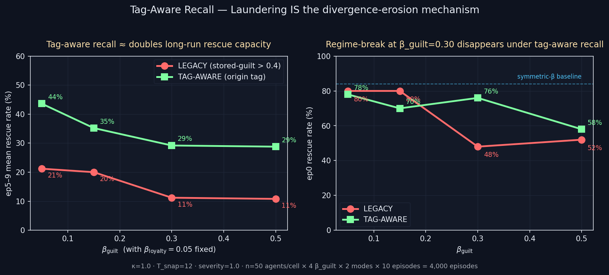

# Tag-Aware Recall — Laundering IS the Mechanism

> **One-line result:** Pinning a memory's class identity to its encoding-time
> tag (instead of its currently-stored guilt channel) approximately DOUBLES
> ep5–9 mean rescue rate at every β_guilt cell and eliminates the
> regime-break at β_guilt=0.30 — confirming that valence laundering is the
> operative mechanism behind divergence-erosion under asymmetric forgiveness.

**Date:** 2026-05-09 · **Episodes:** 4,000 · **Runtime:** ~30 s

## The hypothesis

The 2026-05-07 memory_population_audit + the 2026-05-08 κ-invariance check
established that under asymmetric β_guilt, ~75–81% of failure-tagged memories
have stored loyalty > stored guilt at recall time — they are
"valence-laundered" by the decay arithmetic. The legacy `guilt_recall_strength`
gate asks "is stored.guilt > 0.4?" — a current-state classification that
flips to FALSE under laundering. If laundering IS the mechanism, then
re-routing the gate through encoding-time tags (`seed` / `failure` / `timeout`
qualify regardless of decayed channels) should rescue the committed regime.

## What actually happened

| β_guilt | LEGACY ep0 | TAG-AW ep0 | LEGACY ep5–9 | TAG-AW ep5–9 | Uplift (ep5–9) |
|--------:|-----------:|-----------:|-------------:|-------------:|---------------:|
| 0.05    | 80%        | 78%        | 21.2%        | 43.6%        | **+22.4 pts (2.06×)** |
| 0.15    | 80%        | 70%        | 20.0%        | 35.2%        | **+15.2 pts (1.76×)** |
| 0.30    | **48%**    | **76%**    | 11.2%        | 29.2%        | **+18.0 pts (2.61×)** |
| 0.50    | 52%        | 58%        | 10.8%        | 28.8%        | **+18.0 pts (2.67×)** |

Three things jump out:

- Tag-aware recall lifts long-run rescue capacity at EVERY cell, including
  the symmetric β=0.05 cell — the legacy gate was strict enough that even
  modest decay was eroding the guilt-recall signal.
- The regime collapse at β_guilt=0.30 (LEGACY ep0 drops 80% → 48%) **does
  not happen under tag-aware recall** (ep0 stays at 76%). The decay-arithmetic
  effect is fully neutralized at moderate asymmetry.
- The β_guilt=0.50 ep0 rescue rate doesn't fully recover (58% vs 78%
  symmetric baseline) — at extreme asymmetry, even tag-aware recall partially
  fails. Suggests a SECOND mechanism kicks in at extreme β_guilt — most
  likely the agent's own *current* emotion vector being damped because the
  injected emotion (via `inject_recalled_emotion`) still uses literal stored
  channels that have been laundered.

## Mechanism (interpretation)

`guilt_recall_strength` feeds `emo_ctx['guilt_recall']` which drives the
guilt component of e_t through `GUILT_RATE × guilt_recall - decay`. When the
seeded prior's stored guilt decays below the 0.4 threshold within the first
~5 steps of a high-β_guilt episode, the legacy gate treats it as a non-guilt
memory and the guilt pathway never fires. The agent loses its emotional
pressure to head toward the partner; the committed regime collapses.

Tag-aware recall keeps that pathway active: any memory tagged at encoding
time as a guilt event continues to drive guilt_recall regardless of how
decayed its stored channels are. The ep5–9 uplift is roughly proportional
to how much guilt-class signal is "missing" under legacy — biggest at high
β_guilt where almost all guilt memories have been laundered.

## Implication for the framework

Two follow-ups now sharper:

- The injection pathway (`inject_recalled_emotion`) still uses literal
  decayed stored emotion. Tag-keyed injection (or a per-memory emotion
  *floor* that prevents stored.guilt from falling below e.g. 0.2 if the tag
  is guilt-class) would test whether this is the second mechanism behind
  the residual β_guilt=0.50 ep0 collapse.
- `recharge_on_recall` (next in queue) is a more biologically plausible
  counter-mechanism: rather than ignoring stored channels, every
  reactivation above threshold tops the stored emotion back up by δ. Tests
  whether decay-vs-rehearsal balance is the right framing.

## Files

| file | what |
|---|---|
| `README.md` | this scannable summary |
| `finding.md` | longer analysis with mechanism + falsifiers |
| `results.csv` | 4,000 rows: one per (mode, β_guilt, agent, episode) |
| `tag_aware_recall.png` | headline 2-panel chart |
