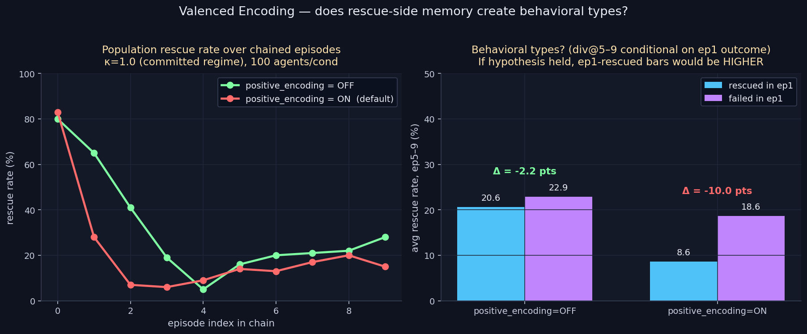

# Valenced Encoding — The Loyalty Boomerang

> **One-line result:** Bidirectional outcome encoding makes the Homogenization
> Collapse WORSE, not better. Turning off rescue-side memory encoding nearly
> doubles long-term rescue rate (28% vs 15% at episode 9).

**Date:** 2026-05-02 · **Episodes:** 2,000 · **Runtime:** ~6 s

## The hypothesis

Encoding loyalty memories on RESCUE (positive valence) — not just guilt
memories on FAILURE (negative valence) — should restore behavioral types.
Agents who happen to rescue early should encode a positive memory and
remain rescue-prone; agents who fail should stay paralyzed. Population
should DIVERGE.

## What actually happened

| metric                                      | OFF (only guilt-on-failure) | ON (both, default) |
|---------------------------------------------|---------------------------:|-------------------:|
| ep0 rescue rate                             | 80.0% | 83.0% |
| ep1 rescue rate                             | 65.0% | 28.0% |
| **ep9 rescue rate**                         | **28.0%** | **15.0%** |
| divergence @ ep5–9 (succ. in ep1 vs failed) | −2.2 pts | **−10.0 pts** |

Two surprises:

1. **The rescue-side encoding is actively harmful.** Without it, the
   committed-rescuer regime decays gracefully and stabilizes around 28%
   long-term rescue rate. With it, the regime collapses to 15% and stays
   there.
2. **Divergence is negative under both conditions.** Agents who succeeded
   in episode 1 are *less* likely to rescue in later episodes than agents
   who failed. There are no behavioral types — there are anti-types. And
   the anti-effect is 5× stronger when positive encoding is on.

## Mechanism (interpretation)

The seeded abandonment prior already contains both guilt and loyalty. With
positive encoding ON, every successful rescue adds *another* loyalty-charged
memory, and the partner-oriented memory population grows fast. Each new
loyalty memory raises the conflict cost of every action that isn't perfectly
partner-aligned, and at softmax temperature 0.15 this slightly randomizes
action selection. The next miss adds a guilt memory; the failure cascade
follows.

With positive encoding OFF, only failures encode. The store grows more
slowly, the seeded prior continues to dominate longer, and the agent stays
in its committed regime longer.

Asymmetric (negative-only) memory encoding turns out to be a stabilizer.

## Implication for the framework

The Homogenization Collapse cannot be fixed by adding a positive-valence
counter-channel — the counter-channel itself accelerates the collapse.
Likely fixes that aren't yet falsified:

- **Asymmetric importance** — encode rescue at much lower importance than failure
- **Bounded memory store** — cap accumulation with LRU/least-impact eviction
- **Decay asymmetry** — faster decay on loyalty memories than guilt memories

These are queued in `docs/research_backlog.md`.

## Files

| file | purpose |
|------|---------|
| `results.csv` | raw 2,000-row sweep |
| `valenced_encoding.png` | 2-panel chart above |
| `finding.md` | longer written analysis |
